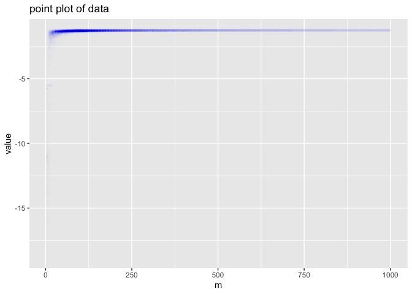
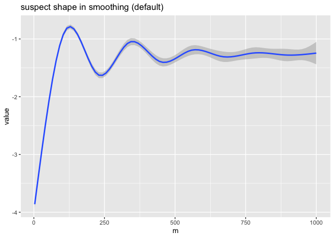
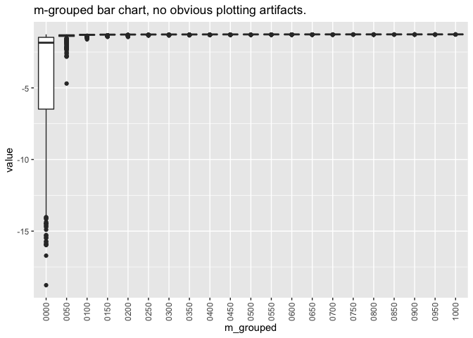
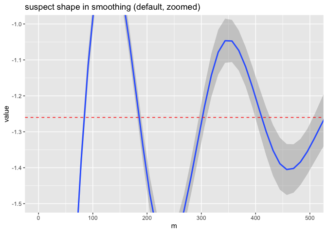
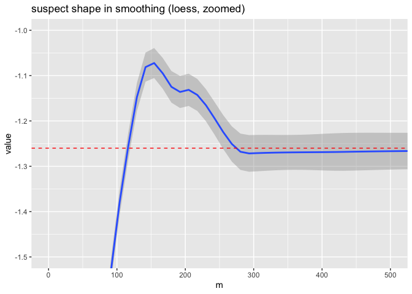
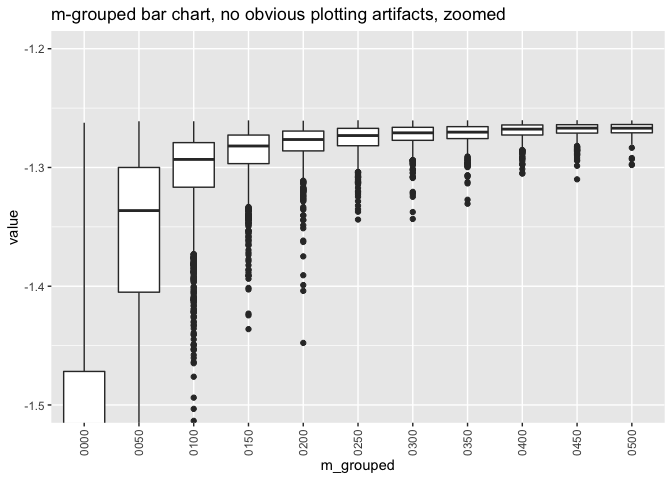
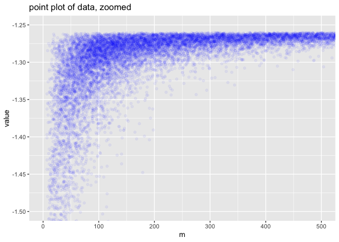
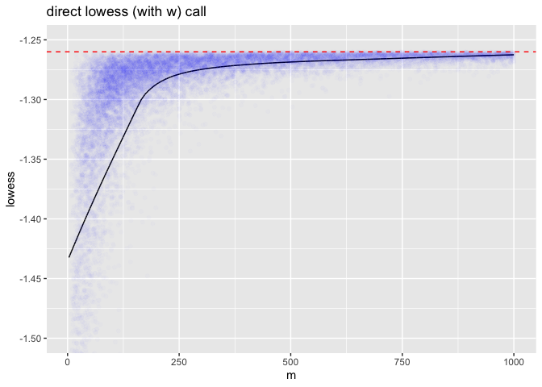

Smoothing isn’t Always Safe
================

Introduction
============

Here is a quick data-scientist / data-analyst question: what is the
overall trend or shape in the following noisy data? For our specific
example: How do we relate `value` as a noisy function (or relation) of
`m`? This example arose in producing our tutorial [“The Nature of
Overfitting”](https://win-vector.com/2021/01/04/the-nature-of-overfitting/).

One would think this would be safe and easy to asses in
[`R`](https://www.r-project.org) using
[`ggplot2::geom_smooth()`](https://CRAN.R-project.org/package=ggplot2),
but now we are not so sure.

Our Example
===========

Let’s first load our data and characterize it a bit

``` r
d <- read.csv(
  'sus_shape.csv', 
  strip.white = TRUE, 
  stringsAsFactors = FALSE)

head(d)
```

    ##   m      value
    ## 1 3 -12.968296
    ## 2 3  -5.522812
    ## 3 3  -6.893872
    ## 4 3  -5.522812
    ## 5 3 -11.338718
    ## 6 3 -10.208145

``` r
summary(d)
```

    ##        m              value        
    ##  Min.   :   3.0   Min.   :-18.773  
    ##  1st Qu.:  86.0   1st Qu.: -1.304  
    ##  Median : 195.0   Median : -1.276  
    ##  Mean   : 288.8   Mean   : -1.508  
    ##  3rd Qu.: 436.0   3rd Qu.: -1.266  
    ##  Max.   :1000.0   Max.   : -1.260

``` r
nrow(d)
```

    ## [1] 15545

Now let’s try and look at this data. First we try a scatter plot with a
low alpha, which gives us something similar to a density presentation.

``` r
library(ggplot2)

ggplot(
  data = d,
  mapping = aes(x = m, y = value)) + 
  geom_point(
    alpha = 0.005, 
    color = 'Blue') + 
  ggtitle("point plot of data")
```

<!-- -->

Each `m` value has many different `value` measurements (representing
repetitions of a noisy experiment). Frankly the above is not that
legible, so we need tools to try and summarize it in the region we are
interested in (`value` near `-1.25`).

Trying Default Smoothing
========================

Let’s run a default smoothing line through this data to try to get the
overall relation.

``` r
ggplot(
  data = d,
  mapping = aes(x = m, y = value)) + 
  geom_smooth() +
  ggtitle("suspect shape in smoothing (default)")
```

    ## `geom_smooth()` using method = 'gam' and formula 'y ~ s(x, bs = "cs")'

<!-- -->

This graph appears to imply some sort of oscillation or structure in the
relation between mean `value` and `m`. We are pretty sure there is no
such structure, and this is an artifact of the smoothing method. This
defect is why we did not use `ggplot2::geom_smooth()` in our note on
training set size.

We *did* see a warning, but we believe this is just telling us which
default values were used, and not indicating the above pathology was
detected.

At this point we are in a pickle. We had theoretical reasons to believe
the data is a monotone increasing in `m` trend, with mean-zero noise
that decreases with larger `m`. The graph doesn’t look like that. So our
understanding or theory could be wrong, or the graph didn’t faithfully
represent the data. The graph had been intended as a *very* small step
in larger work. Re-examining the intricacies of what is the default
behavior of this graphing software was *not* our intended task. We had
been doing some actual research on the data.

Now have a second problem: is this unexpected structure in our data, or
a graphing artifact? The point is: when something appears to work one
can, with some risk, move on quickly; when something appears to not work
in a surprising way, you end up with a lot of additional required
investigation. This investigation is the content of this note, like it
or not. Also in some loud `R` circles, one has no choice but to try “the
default `ggplot2::geom_smooth()` graph”, otherwise one is pilloried for
“not knowing it.”

We can try switching the smoothing method to see what another smoothing
method says. Let’s try `loess`.

``` r
ggplot(
  data = d,
  mapping = aes(x = m, y = value)) + 
  geom_smooth(method = 'loess') +
  ggtitle("suspect shape in smoothing (loess)")
```

    ## `geom_smooth()` using formula 'y ~ x'

<!-- -->

Now we have a different shape. At most one of these (and in fact
neither) is representative of the data. There is, again, a warning. It
appears, again, to be a coding style guide- and not detection of the
issue at hand.

Looking Again
=============

Let’s try a simple grouped box plot. We will group `m` into ranges to
get more aggregation.

``` r
d$m_grouped <- formatC(
  round(d$m/50)*50, 
  width = 4, 
  format = "d", 
  flag = "0")

ggplot(
  data = d,
  mapping = aes(x = m_grouped, y = value)) + 
  geom_boxplot() +
  theme(axis.text.x = element_text(angle = 90, 
                                   vjust = 0.5, 
                                   hjust=1)) +
  ggtitle("m-grouped bar chart, no obvious plotting artifacts.")
```

<!-- -->

For legibility, we repeat these graphs zooming in to the area under
disagreement. We are using `coord_cartesian()` to zoom in, so as to try
and not change the underlying graphing calculation.

``` r
zoom <- coord_cartesian(xlim = c(0, 500), ylim = c(-1.5, -1)) 
```

``` r
ggplot(
  data = d,
  mapping = aes(x = m, y = value)) + 
  geom_smooth() +
  zoom +
  ggtitle("suspect shape in smoothing (default, zoomed)") + 
  geom_hline(
    yintercept = max(d$value), 
    color = 'red', 
    linetype = 2)
```

    ## `geom_smooth()` using method = 'gam' and formula 'y ~ s(x, bs = "cs")'

<!-- -->

This crossing above `-1.0` is very suspicious, as we have `max(d$value)`
= -1.2600449. We have annotated this with the horizontal red dashed
line.

And the entirety of the `loess` hump is also a plotting artifact, also
completely out of the observed data range.

``` r
ggplot(
  data = d,
  mapping = aes(x = m, y = value)) + 
  geom_smooth(method = 'loess') +
  zoom +
  ggtitle("suspect shape in smoothing (loess, zoomed)") + 
  geom_hline(
    yintercept = max(d$value), 
    color = 'red', 
    linetype = 2)
```

    ## `geom_smooth()` using formula 'y ~ x'

<!-- -->

The zoomed-in version of the box plot shows the noisy monotone
asymptotic shape we expected for the original experiment that produced
this data.

``` r
ggplot(
  data = d[d$m <= 500, ],
  mapping = aes(x = m_grouped, y = value)) + 
  geom_boxplot() +
  coord_cartesian(ylim = c(-1.5, -1.2)) +
  theme(
    axis.text.x = element_text(
      angle = 90, 
      vjust = 0.5, 
      hjust=1)) +
  ggtitle("m-grouped bar chart, no obvious plotting artifacts, zoomed")
```

<!-- -->

The point plot, when zoomed, qualitatively agrees with the boxplot.

``` r
ggplot(
  data = d,
  mapping = aes(x = m, y = value)) + 
  geom_point(alpha = 0.05, color = 'Blue') + 
  coord_cartesian(
    xlim = c(0, 500), 
    ylim = c(-1.5, -1.25))  +
  ggtitle("point plot of data, zoomed")
```

<!-- -->

Directly calling `loess`/`lowess`
=================================

`ggplot2` is documented as using `loess`, which in turn is documented as
a newer adapter for `lowess` “with different defaults” then `loess`.
However, the documented exposed controls on these two methods seem
fairly disjoint.

That being said `loess` (without a ‘w’, as in “Uruguay”) called directly
with default arguments shows the same chimeric artifact.


``` r
zoom2 <- coord_cartesian(ylim = c(-1.5, -1)) 
```

``` r
d$loess <- loess(value ~ m, data = d)$fitted

ggplot(
  data = d,
  mapping = aes(x = m)) + 
  geom_line(aes(y = loess)) + 
  geom_point(
    aes(y = value), 
    alpha = 0.01, 
    color = 'Blue') + 
  zoom2 + 
  geom_hline(
    yintercept = max(d$value), 
    color = 'red', 
    linetype = 2) +
  ggtitle('direct loess (no w) call')
```

<!-- -->

Playing with arguments can suppress the artifact, but we still saw weird
(but smaller) effects even with the suggested `degree = 1` alternate
setting.

Directly calling `lowess` (with a ‘w’, as in “answer”) gives a more
reasonable result out of the box.


``` r
d$lowess <- lowess(d$m, d$value)$y

ggplot(
  data = d,
  mapping = aes(x = m)) + 
  geom_line(aes(y = lowess)) + 
  geom_point(
    aes(y = value), 
    alpha = 0.01, 
    color = 'Blue') + 
  geom_hline(
    yintercept = max(d$value), 
    color = 'red', 
    linetype = 2) +
  coord_cartesian(
    ylim = c(-1.5, -1.25)) + 
  ggtitle('direct lowess (with w) call')
```

<!-- -->

Simple Windowing
================

Simple methods from fields such as signal processing work well. For
example, a simple square-window moving average appears to correctly tell
the story. These are the methods I use, at the risk of being told I
should have used `geom_smooth()`.

``` r
# requires development version 1.3.2
# remotes::install_github('WinVector/WVPlots')
library(WVPlots)  
```

    ## Loading required package: wrapr

``` r
ConditionalSmoothedScatterPlot(
  d,
  xvar = 'm', 
  yvar = 'value', 
  point_color = "Blue",
  point_alpha = 0.01,
  k = 51,
  groupvar = NULL, 
  title = 'Width 51 square window on data (zoomed)') +
  coord_cartesian(ylim = c(-1.5, -1.25)) + 
  geom_hline(
    yintercept = max(d$value), 
    color = 'red', 
    linetype = 2)
```

<!-- -->

The fact that the hard window yields a jagged curve gives an indication
of the amount of noise in each region of the graph.

Conclusion
==========

Large data sets are inherently illegible. So we rely on summaries and
aggregations to examine them. When these fail we may not always be in a
position to notice the distortion, and this can lead to problems.

Many of the above default summary presentations were deeply flawed and
showed chimerical artifacts not in the data being summarized. Starting a
research project to understand the nature of the above humps and
oscillations would be fruitless, as they are not in the data, but
instead artifacts of the plotting and analysis software.

As a consultant this is disturbing: I end up spending time on debugging
the tools, and not on the client’s task.

The above were not flaws in `ggplot2` itself, but in the use of the
`gam` and `loess` smoothers, which are likely introducing the artifacts
by trying to enforce certain curvature conditions not in the data. We
are essentially looking at something akin to Gibbs’ phenomenon or
ringing. This could trip up the data scientist or the data analyst
without a background in signal analysis.

This sort of problem reveals the lie in the typical “data scientist
&gt;&gt; statistician &gt;&gt; data analyst” or “statistics are always
correct in `R`, and never correct in `Python`” snobberies. In fact a
data analyst would get the summary shapes right, as presentation of this
sort is one of their specialties.
