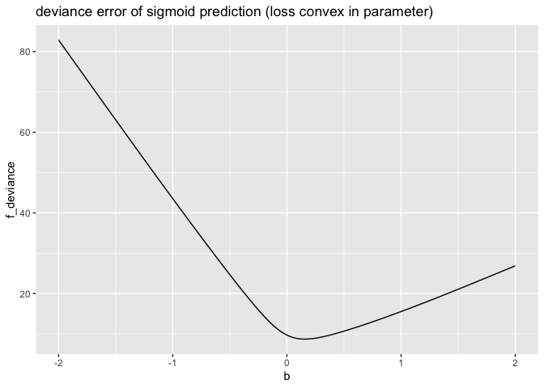
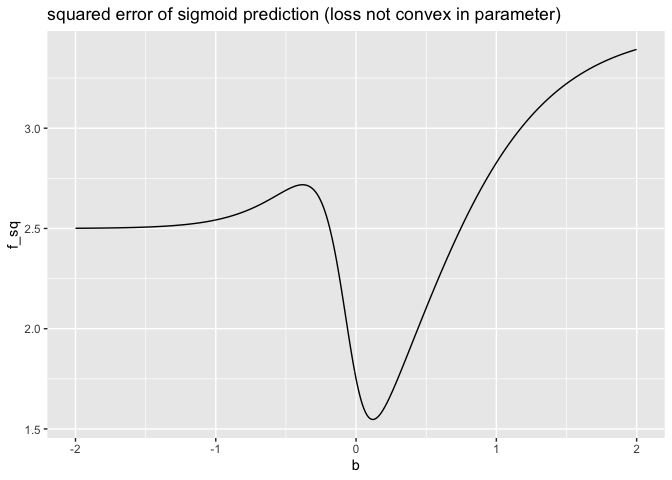

Square Error Example
================
John Mount, Win-Vector LLC

This is an example of the non-convex structure of the squared error of
sigmoid predictions (that is loss with respect to model parameters). The
non-convexity was discussed in [“Why not Square Error for
Classification?”](https://github.com/WinVector/Examples/blob/main/WhyNotSquareError/why_deviance.ipynb)
(that example is in `Python`, this one is in `R`), and this is an
example where finding optimal parameter values could be made harder by
the non-convexity.

``` r
library(ggplot2)
```

``` r
sigmoid <- function(x) {
  1/(1 + exp(-x))
}

# square-loss, a good loss for general numeric regressions
# not recommended for probability/classification problems
f_sq <- function(b, d) {
  sum( (d$y - sigmoid(b * d$x))^2 )
}

# deviance loss. monotone-equivalent to cross entropy
# good loss for probability/classification problems
f_deviance <- function(b, d) {
  -2 * sum( d$y * log(sigmoid(b * d$x)) + 
            (1-d$y) * log(1 - sigmoid(b * d$x)) )
}
```

Set up some example data. `x` is the explanatory variable, `y` is the
categorical (`0`/`1` in this case) dependent variable to be predicted.

``` r
d <- data.frame(
  x = c(-2, -2, -2, 0, 0, 10, 10),
  y = c(1, 1, 1, 0, 1, 1, 1)
)

knitr::kable(d)
```

|   x | y |
| --: | -: |
| \-2 | 1 |
| \-2 | 1 |
| \-2 | 1 |
|   0 | 0 |
|   0 | 1 |
|  10 | 1 |
|  10 | 1 |

Plot model loss as a function of the model parameter `b`. Typical a `b`
with minimal loss on the training data is selected as a best model.

``` r
plt_frame = data.frame(
  b = seq(-2, 2, by = 0.01)
)

# vapply is R's equivalent of Python's list comprehension
plt_frame$f_sq <- vapply(
  plt_frame$b,
  function(b) { f_sq(b, d) },
  numeric(1)
)

plt_frame$f_deviance <- vapply(
  plt_frame$b,
  function(b) { f_deviance(b, d) },
  numeric(1)
)
```

Deviance error of the sigmoid prediction *is* convex. This tends to make
optimization easier.

``` r
ggplot(data = plt_frame, aes(x = b, y = f_deviance)) + 
  geom_line() +
  ggtitle("deviance error of sigmoid prediction (loss convex in parameter)")
```

<!-- -->

The deviance loss is the basis of logistic regression, and also monotone
equivalent to cross-entropy. It can be thought of as the average number
of bits of surprise or correction needed using the predicted
probabilities to encode data with the actual `y`-outcome probabilities
being the true distribution. At deviance zero there is no surprise, and
at large deviance the predictions are not doing well.

Squared error of the sigmoid prediction is *not* convex. In this case it
means there are portions where the curve is above its linear
interpolate, and even local minima that are not connected.

``` r
ggplot(data = plt_frame, aes(x = b, y = f_sq)) + 
  geom_line() +
  ggtitle("squared error of sigmoid prediction (loss not convex in parameter)")
```

<!-- -->

The non-convexity can make optimization more difficult in general. For
example a gradient descent optimizer starting at `b = -1` may have
difficulty making it to the optimal `b` much closer to `0`.

Note: it appears a variant of the square error for probabilities is
called the [Brier score](https://en.wikipedia.org/wiki/Brier_score) and
used in some fields. Our opinion is the deviance and cross-entropy are
in fact better losses, well taught (see [Cover/Thomas *Elements of
Information
Theory*](http://staff.ustc.edu.cn/~cgong821/Wiley.Interscience.Elements.of.Information.Theory.Jul.2006.eBook-DDU.pdf)),
and should be preferred. Square error may be a “good enough” measure for
some applications, but I doubt
[cross-entropy](https://en.wikipedia.org/wiki/Cross_entropy) is worse
for these applications.
