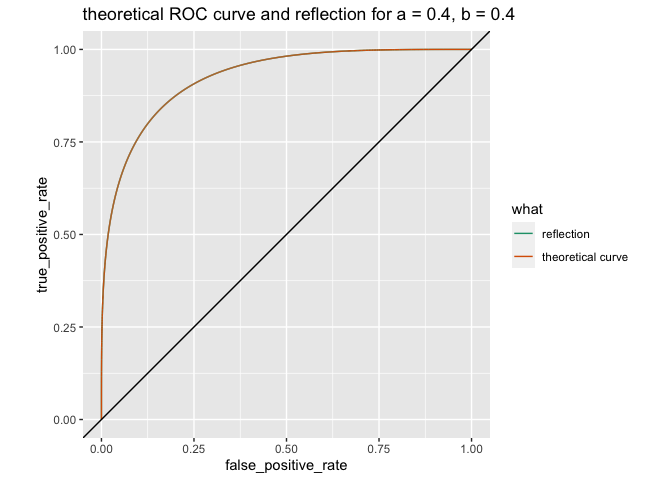
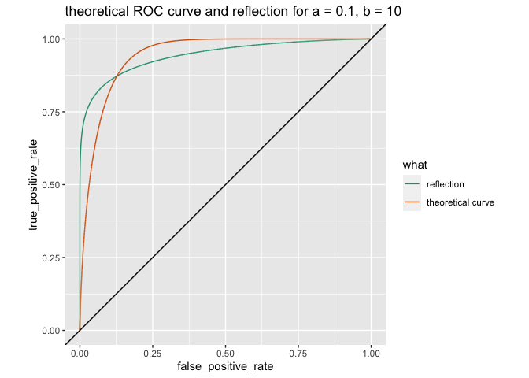

Asymmetry in the ROC Families
================

This is the source for a link shared in
[here](https://win-vector.com/2020/10/29/a-single-parameter-family-characterizing-probability-model-performance/).

The consequence of this is pretty large. We think the observable skew of
the [Beta distribution characterization of a fully calibrated
model](https://win-vector.com/2020/10/29/a-single-parameter-family-characterizing-probability-model-performance/)
is a function of the data prevalence This means one can read off the
prevalence from the observed skew, and the ROC plot does not in fact
fully integrate out the prevalence in this case.

``` r
library(ggplot2)
```

``` r
mk_frame <- function(a, b, eval_points = seq(0, 1, 1e-5)) {
  tf <- data.frame(
    what = 'theoretical curve',
    a = a,
    b = b,
    false_positive_rate = 1 - pbeta(eval_points, shape1 = a, shape2 = b + 1),
    true_positive_rate = 1 - pbeta(eval_points, shape1 = a + 1, shape2 = b),
    stringsAsFactors = FALSE)
  
  reflect <- data.frame(
    what = 'reflection',
    a = a,
    b = b,
    false_positive_rate = 1 - tf$true_positive_rate,
    true_positive_rate = 1 - tf$false_positive_rate,
    stringsAsFactors = FALSE)
  
  rbind(tf, reflect)
}

mk_plot <- function(data) {
  a <- data$a[[1]]
  b <- data$b[[1]]
  ggplot(
    data = data,
    mapping = aes(
      x = false_positive_rate, 
      y = true_positive_rate, 
      color = what)) +
    geom_line() + 
    geom_abline(intercept = 0, slope = 1) +
    coord_fixed() +
    scale_color_brewer(palette = "Dark2") +
    ggtitle(paste0(
      "theoretical ROC curve and reflection for a = ", 
      format(a, digits = 2),
      ", b = ",
      format(b, digits = 2)))
}
```

``` r
a <- 0.4
b <- a

uniform_example <- mk_frame(a, b)
mk_plot(uniform_example)
```

<!-- -->

``` r
a <- 0.1
b <- 10

skew_example <- mk_frame(a, b)
mk_plot(skew_example)
```

<!-- -->
