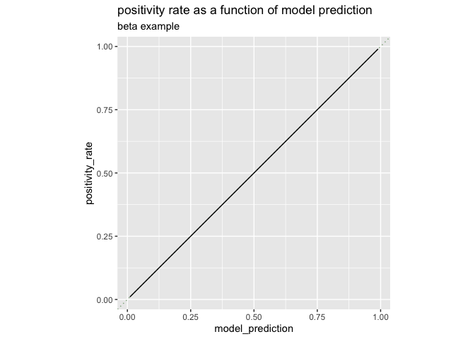
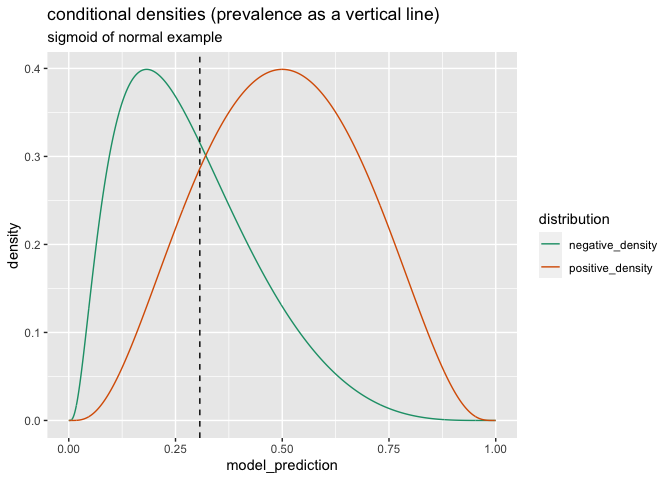

Checking Probabilty Model Calibration
================

This is a quick note showing if it is obvious which conditional
distributions are fully calibrated in the sense we have been writing
about [here](https://win-vector.com/tag/calibrated-models/).

To start, we attach packages.

``` r
library(ggplot2)
library(WVPlots)
library(sigr)
library(cdata)
```

Generate example data. Our first example is the fully calibrated Beta
distributed data demonstrated in [“A Single Parameter Family
Characterizing Probability Model
Performance”](https://win-vector.com/2020/10/29/a-single-parameter-family-characterizing-probability-model-performance/).

``` r
# build conditioned densities

mk_beta_example <- function(a, b) {
  eval_points <- seq(0, 1, by = 0.01)
  data.frame(
    model_prediction = eval_points,
    positive_density = dbeta(eval_points, shape1 = a + 1, shape2 = b),
    negative_density = dbeta(eval_points, shape1 = a, shape2 = b + 1))
}

d_beta <- mk_beta_example(a = 2, b = 3)
```

Define the analysis sequence.

``` r
characterize_dists <- function(d, subtitle = NULL, make_plots = TRUE) {
  # Infer implied prevalence.
  # meanpos * prevalence + meanneg * (1 - prevalence) = prevalence
  # so prevalence = meanneg / (meanneg + 1 - meanpos)
  meanpos <- sum(d$positive_density * d$model_prediction) / sum(d$positive_density)
  meanneg <- sum(d$negative_density * d$model_prediction) / sum(d$negative_density)
  prevalence <- meanneg / (meanneg + 1 - meanpos)
  d$positivity_rate <- prevalence * d$positive_density / 
    (prevalence * d$positive_density + (1 - prevalence)*d$negative_density)
  dplot <- NULL
  rplot <- NULL
  
  if(make_plots) {
    # Plot densities.
    dplt <- cdata::pivot_to_blocks(
      d,
      nameForNewKeyColumn = 'distribution',
      nameForNewValueColumn = 'density',
      columnsToTakeFrom = qc(positive_density, negative_density))
    
    dplot <- ggplot(
      data = dplt,
      mapping = aes(
        x = model_prediction,
        y = density,
        color = distribution)) + 
      geom_line() +
      geom_vline(xintercept = prevalence, linetype = 2) +
      scale_color_brewer(palette = "Dark2") + 
      ggtitle("conditional densities (prevalence as a vertical line)",
              subtitle = subtitle)
    
    # Show prediction ratios. 
    # For a  we expect the data to be on the line `y=x`.
    # Please see: 
    #  https://win-vector.com/2020/10/29/a-single-parameter-family-characterizing-probability-model-performance/
    rplot <- ggplot(
      data = d[complete.cases(d), ],
      mapping = aes(
        x = model_prediction,
        y = positivity_rate)) + 
      geom_abline(slope = 1, intercept = 0, linetype = 3, alpha = 0.5, color = "DarkGreen") +
      coord_fixed() + 
      scale_color_brewer(palette = "Dark2") + 
      geom_line() +
      ggtitle("positivity rate as a function of model prediction",
              subtitle = subtitle)
  }
  
  # return results as a named list
  list(d = d, prevalence = prevalence, dplot = dplot, rplot = rplot)
}
```

Let’s look at the results. We are using the ideas of [“The Double
Density Plot Contains a Lot of Useful
Information”](https://win-vector.com/2020/10/27/the-double-density-plot-contains-a-lot-of-useful-information/)
to infer prevalence.

``` r
unpack[
  dplot_beta = dplot,
  rplot_beta = rplot
  ] <- characterize_dists(d_beta, "beta example")


print(dplot_beta)
```

<!-- -->

``` r
print(rplot_beta)
```

<!-- -->

Notice the `(a+1, b)` `(a, b+1)` distributions have different variances.
However these variances are related, and required to have this relation
to get the full calibration conditions for this example.

``` r
# ref: https://en.wikipedia.org/wiki/Beta_distribution
beta_var <- function(a, b) {
  a * b / ((a + b)^2 * (a + b + 1))
}

beta_var(2 + 1, 3)
```

    ## [1] 0.03571429

``` r
beta_var(2, 3 + 1)
```

    ## [1] 0.03174603

Let’s look at this for a “sigmoid of normal” (similar to [“Your Lopsided
Model is Out to Get
You”](https://win-vector.com/2020/10/26/your-lopsided-model-is-out-to-get-you/),
but we are making the positive class rare, taking the calibration
implied prevalence, and looking if we further achieve full calibration).

``` r
# build conditioned densities

mk_normal_example <- function(mean_pos, sd_pos, mean_neg, sd_neg) {
  eval_points <- seq(-10, 10, by = 0.01)
  sigmoid <- function(x) { 1 / (1 + exp(-x)) }
  data.frame(
    model_prediction = sigmoid(eval_points),
    positive_density = dnorm(eval_points, mean = mean_pos, sd = sd_pos),
    negative_density = dnorm(eval_points, mean = mean_neg, sd = sd_neg))
}

d_normal <- mk_normal_example(
  mean_pos = 0, sd_pos = 1, 
  mean_neg = -1.5, sd_neg = 1)
```

``` r
unpack[
  dplot_normal = dplot,
  rplot_normal = rplot,
  d_aug = d
  ] <- characterize_dists(d_normal, "sigmoid of normal example")


print(dplot_normal)
```

<!-- -->

``` r
print(rplot_normal)
```

<!-- -->

``` r
mean((d_aug$model_prediction - d_aug$positivity_rate)^2)
```

    ## [1] 0.001849245

Notice the “sigmoid of normal” system is not fully calibrated. Our work
on [double-crossings of
normals](https://win-vector.com/2020/10/26/your-lopsided-model-is-out-to-get-you/),
makes us suspect this can’t be fixed by a variance adjustments.

We can try and see if there is an obvious adjustment of variances that
balances everything at once.

``` r
perturbed_normal_example <- function(x) {
  mk_normal_example(
    mean_pos = 0, sd_pos = 1 - x, 
    mean_neg = -1.5, sd_neg = 1 + x)
}

f <- function(x) {
  d_normal <- perturbed_normal_example(x)
  dat <- characterize_dists(d_normal, "sigmoid of normal example", make_plots = FALSE)
  d_aug <- dat$d
  mean((d_aug$model_prediction - d_aug$positivity_rate)^2)
}

soln <- optimize(f, interval = c(-0.5, 0.5))

print(soln)
```

    ## $minimum
    ## [1] 0.05053756
    ## 
    ## $objective
    ## [1] 0.001289792

``` r
d_normal2 <- perturbed_normal_example(soln$minimum)

unpack[
  dplot_normal2 = dplot,
  rplot_normal2 = rplot,
  d_aug2 = d
  ] <- characterize_dists(d_normal2, "perturbed of normal example")


print(dplot_normal2)
```

<!-- -->

``` r
print(rplot_normal2)
```

<!-- -->

``` r
mean((d_aug2$model_prediction - d_aug2$positivity_rate)^2)
```

    ## [1] 0.001289792

While we see some improvement in loss, we don’t see an obvious complete
match.
