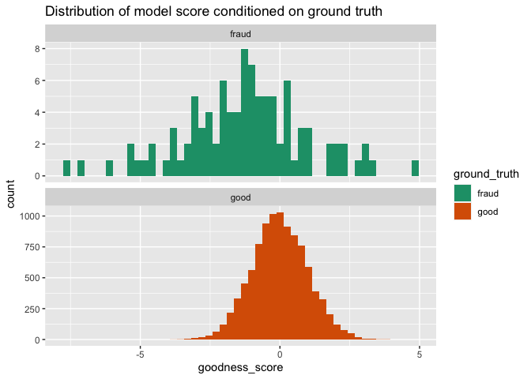
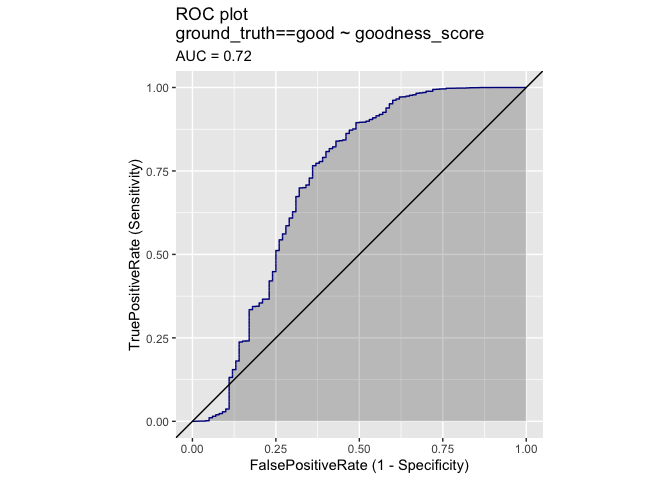
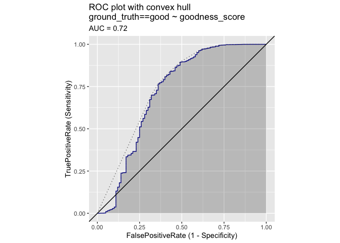
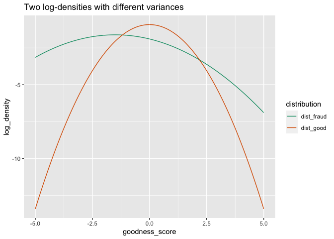
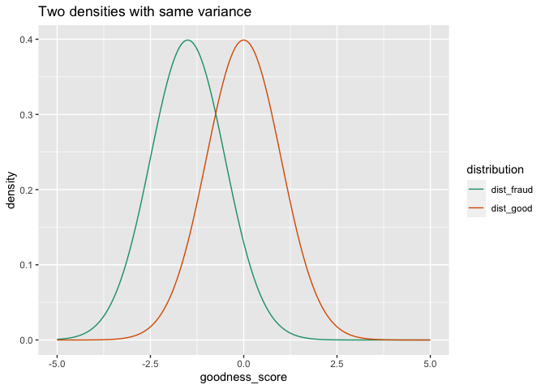
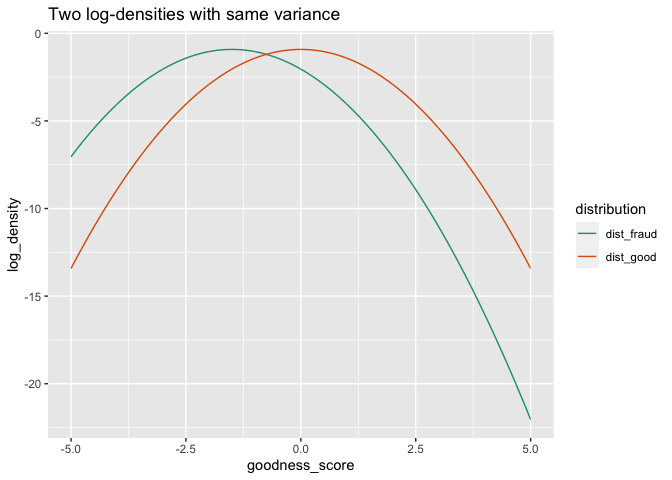

Your Lopsided Model *is* Out to Get You
================

This is the source for the article shared
[here](https://win-vector.com/2020/10/26/your-lopsided-model-is-out-to-get-you/).

For classification problems I argue one of the biggest steps you can
take to improve the quality and utility of your models is to [prefer
models that return scores or return probabilities instead of
classification
rules](https://win-vector.com/2020/08/07/dont-use-classification-rules-for-classification-problems/).
Doing this also opens a second large opportunity for improvement:
working with your domain experts to find new variables to lower the
variance in prediction on your weakest outcome category.

In this note we will show the problems of unbalanced or lopsided
classification models, and suggest how to use this variance criticism as
a tool for improvement.

Introduction
------------

I believe that many experienced data scientists have run into the
following problem. You build a scoring model or probability scoring
model and pick an “obviously best example” to show that the score
predicts outcome. The model then kicks you in the teeth, and shows the
outcome that is not supposed to happen. For example: you build a credit
model to predict if a transaction is safe, you take the example with
highest safety score, and this example turns out to be fraud.

I used to think this was just an example of the so-called “law of small
numbers”: small samples have good chances of showing weird behavior.
However, I now feel there are some common modeling flaws that actually
can make this sort of malfunction very likely.

### Set Up

I am going to show the following.

> Unless one controls for prediction variance conditioned on outcome,
> one is quite likely to see model predictions that are wrong on one
> side of a model scoring range.

For example, a seemingly good model where high scores predict good
transactions may assign *highest* scores to some fraudulent
transactions. We can call this “the model going insane at one of the
ends.”

This is an understood issue related to the un-desirable presence of
non-constant variance of the prediction when conditioned on the
ground-truth outcome. Roughly we can think of this as
[heteroscedasticity](https://en.wikipedia.org/wiki/Heteroscedasticity),
but in a signal detection context. This issue is a reason why equal
variance is often assumed (or insisted on) in [ROC (Receiver Operating
Characteristic
plot)](https://en.wikipedia.org/wiki/Receiver_operating_characteristic)
frameworks (reference: James P. Egan, *Signal Detection Theory and ROC
Analysis*, Academic Press, 1975).

### Our Example

Let’s make this more specific through a concrete example.

We are building a model to sort possible fraudulent transactions from
good ones. We are in the nice situation where our model score is a
normally distributed number in what is called “link space” (the logit of
a probability, or the logarithm of an odds ratio). High scores are
indicative of non-fraudulent transactions and low scores are indicative
of fraudulent transactions. And we are in a nice case where fraudulent
transactions are rare.

Let’s use [`R`](https://www.r-project.org) to set up a synthetic example
with these properties.

``` r
# attach our packages
library(ggplot2)
library(WVPlots)
library(rquery)
```

``` r
# specify parameters
fraud_prevalence <- 0.01
data_size = 10000
mean_good <- 0
sd_good <- 1
mean_fraud <- -1.5
sd_fraud <- 2
```

``` r
# generate example data
set.seed(2020)

examples <- rbind(
  data.frame(  # fraud examples have one normal distribution
    goodness_score = rnorm(
      n = round(fraud_prevalence*data_size), 
      mean = mean_fraud, 
      sd = sd_fraud),
    ground_truth = 'fraud',
    stringsAsFactors = FALSE),
  data.frame(  # non-fraud examples have another normal distribution
    goodness_score = rnorm(
      n = round((1-fraud_prevalence)*data_size), 
      mean = mean_good, 
      sd = sd_good),
    ground_truth = 'good',
    stringsAsFactors = FALSE)
  )
```

Let’s confirm the mean score for good examples is higher than the
mean-score for fraudulent examples.

``` r
examples %.>%
  aggregate(goodness_score ~ ground_truth, data = ., FUN = mean) %.>%
  rename_columns(., 'mean_goodness_score' := 'goodness_score') %.>%
  knitr::kable(.)
```

| ground\_truth | mean\_goodness\_score |
|:--------------|----------------------:|
| fraud         |            -1.2822164 |
| good          |            -0.0113797 |

The above might be all one checks for in a linear discriminant
framework. Obviously, we should look at a lot more.

And now let’s exhibit the problem: the item with highest goodness score
is an example of fraud!

``` r
examples %.>%
  .[.$goodness_score >= max(.$goodness_score), ] %.>%
  knitr::kable(.)
```

|     | goodness\_score | ground\_truth |
|:----|----------------:|:--------------|
| 64  |        4.903264 | fraud         |

This is very embarrassing. The example with the highest “good” score is
fraud. And “fraud” is the rare class.

``` r
table(ground_truth = examples$ground_truth) %.>%
  knitr::kable(.)
```

| ground\_truth | Freq |
|:--------------|-----:|
| fraud         |  100 |
| good          | 9900 |

How did it even sneak in? Well that is what fraud does.


It is good that we spot-checked this. Hopefully we checked this before
the model went into production, or before our boss performed such a
spot-check.

### Diagnosis

Let’s look at the data. First we plot the distribution of model scores
conditioned on outcome.

``` r
ggplot(
  data = examples,
  mapping = aes(x = goodness_score, fill = ground_truth)) + 
  geom_histogram(bins = 50) +
  facet_wrap(~ ground_truth, ncol = 1, scales = 'free_y') +
  scale_fill_brewer(palette = "Dark2") +
  ggtitle("Distribution of model score conditioned on ground truth") 
```

<!-- -->

We now see the source of the problem. The fraudulent transactions do
have a lower mean, but they also a higher standard deviation (or
variance).

``` r
examples %.>%
  aggregate(goodness_score ~ ground_truth, data = ., FUN = sd) %.>%
  rename_columns(., 'sd_goodness_score' := 'goodness_score') %.>%
  knitr::kable(.)
```

| ground\_truth | sd\_goodness\_score |
|:--------------|--------------------:|
| fraud         |           2.2385836 |
| good          |           0.9955967 |

Obviously emprical standard deviations will never exactly match, but
these are pretty far off.

We will show that this means the fraudulent transactions dominate both
the lowest and highest regions of model score! This isn’t just a
small-data problem. This (simulated) classifier has a flaw that few data
scientists still check for: the model prediction has different variances
for different values of the ground truth. This is a model pathology that
we should look for and try and fix.

#### More diagnostics

At this point it should be easy to argue that visualizing your results
is very important. Having some canned or ready-to-go diagnostic plots
makes this much easier, and makes it more likely one will take the time
to look. Let’s try a few such plots from the [WVPlots
package](https://github.com/WinVector/WVPlots).

On a [double density
plot](https://winvector.github.io/WVPlots/reference/DoubleDensityPlot.html)
the mis-matched variances are much easier to see.

``` r
DoubleDensityPlot(
  examples,
  xvar = 'goodness_score', 
  truthVar = 'ground_truth',
  truth_target = 'good',
  title = "Density of model predictions conditioned on ground truth")
```

<!-- -->

On a traditional [ROC
plot](https://winvector.github.io/WVPlots/reference/ROCPlot.html) the
flaw is the non-convex kink where the model dives under the `y=x` line.

``` r
ROCPlot(
  examples,
  xvar = 'goodness_score', 
  truthVar = 'ground_truth',
  truthTarget = 'good',
  title = "ROC plot")
```

<!-- -->

Modern data scientists know to look for dips below the `y=x` line.
Looking for non-convexities (or “improper ROC plots”) is a now
under-taught precaution. In signal detection parlance the model is
considered inadmissible or inoperable in regions where the actual or
empirical ROC curve is below its convex hull (reference: James P. Egan,
*Signal Detection Theory and ROC Analysis*, Academic Press, 1975).

``` r
ROCPlot(
  examples,
  xvar = 'goodness_score', 
  truthVar = 'ground_truth',
  truthTarget = 'good',
  add_convex_hull = TRUE,
  title = "ROC plot with convex hull")
```

<!-- -->

In this case we see the model is not to be trusted in the region of
`1-Specificity` less than 0.3 or of `Sensitivity` below `0.7`.

The Cause
---------

Now that we see the problem I want to show that this isn’t a small-data
chance-driven fluke. This is an issue arising from the mis-matched
standard deviations (or variances) of the predictions when conditioned
on ground truth.

To get away from discrete empirical data, let’s look at the ideal
densities that generated our empirical data.

``` r
# points to plot density at
goodness_score <- seq(-5, 5, by = 0.01)
```

``` r
# generate the theoretical densities
d_at_variance <- rbind(
  data.frame(
    goodness_score = goodness_score,
    log_density = dnorm(
      goodness_score, 
      mean = mean_good, 
      sd = sd_good, 
      log = TRUE),
    distribution = 'dist_good',
    stringsAsFactors = FALSE
  ),
 data.frame(
    goodness_score = goodness_score,
    log_density = dnorm(
      goodness_score, 
      mean = mean_fraud, 
      sd = sd_fraud, 
      log = TRUE),
    distribution = 'dist_fraud',
    stringsAsFactors = FALSE
  ))
d_at_variance$density <- exp(d_at_variance$log_density)
```

``` r
# plot the densities
ggplot(
  data = d_at_variance,
  mapping = aes(
    x = goodness_score, 
    y = density, 
    color = distribution)) + 
  geom_line() +
  scale_color_brewer(palette = "Dark2") +
  ggtitle("Two densities with different variances")
```

<!-- -->

Notice the densities show the same flaw we saw in the empirical
simulated data: the fraud cases dominate the high-scoring region of the
density plot. Visually this is seen as the `dist_fraud` density is above
the `dist_good` density on both sides of the graph. Or: the density
plots cross twice. This is due to the larger variance seen in the
predictions conditioned on the ground truth having a value of “fraud.”

Where these crossings happen in practice depends on the prevalence,
which is not shown in these graphs, but the crossing happen for all
proposed prevalences.

The crossings are even clearer if we plot log-densities, which for
normal distributions are just downward opening parabola.

``` r
ggplot(
  data = d_at_variance,
  mapping = aes(
    x = goodness_score, 
    y = log_density, 
    color = distribution)) + 
  geom_line() +
  scale_color_brewer(palette = "Dark2") +
  ggtitle("Two log-densities with different variances")
```

<!-- -->

And this is the problem.Two parabolas arising from normals with
different variances cross each other twice, not once. That means one of
the parabolas (the “good” density) is only highest for a finite interval
of model scores, and the other (the “fraud” density) is highest on both
ends of the plot.

This means this model score is not a monotone predictor of the ground
truth, which is something we implicitly assume when we convert such a
model score into a decision rule by comparing a decision threshold.

As we have said, this pathology remains present even if we re-scale the
densities to reflect prevalence.

### The Failing Intuition

The intuition that is failing us is: we think of model scores as having
the same variance for each ground-truth class. But in practice we rarely
check for this, and very rarely teach how to establish this. However in
signal detection theory, the equal variance model was a central
assumption to be enfornced and probably checked (reference: James P.
Egan, *Signal Detection Theory and ROC Analysis*, Academic Press, 1975).

When variances/standard-deviations match then we get a score that
induces proper intervals. One ground truth class dominates on one side
of a prediction score threshold, and the other ground truth class
dominates on the other side of the same prediction score threshold. The
plots in such a situation look like the following.

``` r
# generate simulated density where both conditional 
# distributions hare the same variance or standard deviation
d_same <- rbind(
  data.frame(
    goodness_score = goodness_score,
    log_density = dnorm(
      goodness_score, 
      mean = mean_good, 
      sd = sd_good, 
      log = TRUE),
    distribution = 'dist_good',
    stringsAsFactors = FALSE
  ),
 data.frame(
    goodness_score = goodness_score,
    log_density = dnorm(
      goodness_score, 
      mean = mean_fraud, 
      sd = sd_good, 
      log = TRUE),
    distribution = 'dist_fraud',
    stringsAsFactors = FALSE
  ))
d_same$density <- exp(d_same$log_density)
```

``` r
# plot the idea case
ggplot(
  data = d_same,
  mapping = aes(
    x = goodness_score, 
    y = density, 
    color = distribution)) + 
  geom_line() + 
  scale_color_brewer(palette = "Dark2") +
  ggtitle("Two densities with same variance")
```

<!-- -->

``` r
ggplot(
  data = d_same,
  mapping = aes(
    x = goodness_score, 
    y = log_density, 
    color = distribution)) + 
  geom_line() + 
  scale_color_brewer(palette = "Dark2") +
  ggtitle("Two log-densities with same variance")
```

<!-- -->

Parabolas with the same curvature are either disjoint, coincident, or
cross each other exactly once. There are no reversals in trend.

### Why Do Things Seem to Work?

If mismatching variances are so bad, why does modeling routinely work
well?

<a href="http://plasmasturm.org/log/6debug/"></a>

One reason is: we tend to pick models by optimization. If we are using
an optimization objective function such as deviance or cross-entropy
then these out of order predictions are the ones most strongly penalized
against. For deviance / cross-entropy, being wrong on extreme scores
costs much more than being wrong on intermediate scores. So
deviance-based procedures likely balance the variances as one of their
consequences. Other objective functions may not have similar effects.

So the inspection of conditional variances may be more important when
using [objectives other than deviance or
cross-entropy](https://win-vector.com/2020/08/31/why-not-square-error-for-classification/).

The Intermediate Conclusion
---------------------------

Models getting the highest or lowest scoring examples systematically
wrong is *not* always due to chance. In fact this flaw can be forced
when we have the pathology that our model’s scores have difference
standard-deviations or variances when conditioned on ground truth. Not
checking these conditional standard deviations is a bad, but likely a
common practice.

The Fix
-------

To mitigate the above pathology we can add the following procedure to
our modeling practice:

> Introduce more diverse features relevant to the ground truth class
> with the larger variance.

The idea is: for a large class of models (including Naive Bayes,
logistic regression, and possibly tree-based ensemble methods such as
gradient boosting and random forest) we can think of the prediction
score as hopefully being a sum of small somewhat independent
contributions from variables or from conjunctions/interactions of
variables. If such holds, then we expect adding more diverse variables
relevant to a ground truth class should help decrease the variance in
model predictions seen for that class.

Or in less technical, and more domain friendly terms.

> The prediction density with the larger variance is the one your model
> understands the least. Use that criticism to drive improvements.

We suggest: try and bolster the model’s understanding by introducing
more diverse variables related to the large variance class.

In our example fraud had higher variance, we can take this as evidence
that we have more useful variables describing the behavior of
non-fraudulent transactions, and fewer describing froud. Our quickest
avenue for model improvement would be to sample some examples of fraud
and look for common features to add to our model.

The Actual Conclusion
---------------------

The double density plot contains a lot of diagnostic information. For
example: seeing different standard deviations or variances is a warning
of one type of a common model pathology that can cause an undesirable
reversal of model signal. Eliminating this issue by introducing more
diverse variables relevant to the high-variance class can be a
constructive path to a fundamentally better model. The plots are giving
hints as to what sore of variables one should wish for, or what to ask
domain expert partners to look into.
