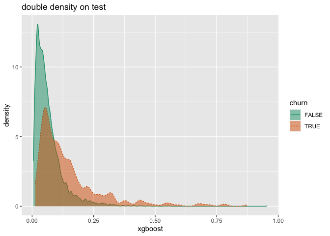
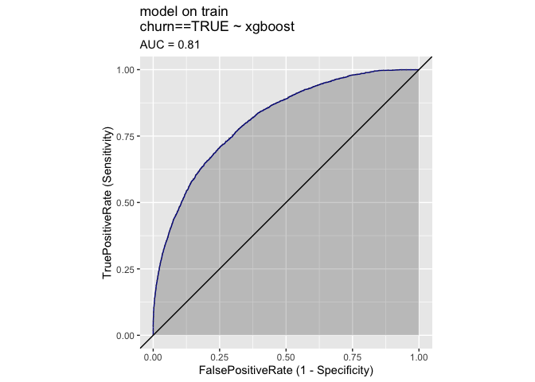
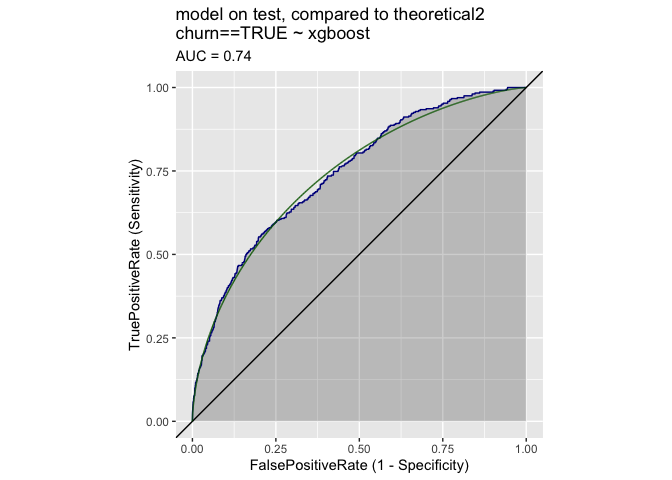

Prediction Plot
================

See if we can infer distributional facts from the empirical ROC plot.

It looks like the prevalence is not obvious from the empirical plot,
though it is where the parameterization achieves slope 1, which is also
where the distance off the diagonal is maximized.

``` r
library(wrapr)
library(ggplot2)
library(WVPlots)
```

``` r
unpack[
  train_p,
  test_p
] <- readRDS('predictions.RDS') # from https://github.com/WinVector/vtreat/tree/main/Examples/KDD2009
```

``` r
ROCPlot(
  test_p,
  xvar = 'xgboost',
  truthVar = 'churn',
  truthTarget = TRUE,
  title = 'model on test',
  add_convex_hull = TRUE)
```

<!-- -->

Use the method of “A Single Parameter Family Characterizing Probability
Model Performance” to identify the ROC curve from the restricted family.

First get `a, b` shape family. We are considering curves of the form
`(a = c * a1, b = c * b1)` for positive `c`.

``` r
(prevalence <- mean(test_p$churn))
```

    ## [1] 0.0724

``` r
(a1 <- 1)
```

    ## [1] 1

``` r
(b1 <- a1 * (1 - prevalence) / prevalence)
```

    ## [1] 12.81215

``` r
a1 / (a1 + b1)
```

    ## [1] 0.0724

Now get the ideal AUC seen.

``` r
calc_area <- function(x, y) {
  n <- nrow(data)
  dx <- abs(x[-length(x)] - x[-1])
  my <- (y[-length(x)] + y[-1])/2
  sum(dx*my)
}
```

``` r
roc_curve <- sigr::build_ROC_curve(
  modelPredictions = test_p$xgboost, 
  yValues = test_p$churn)

idxs <- sort(unique(chull(
  x = c(1 - roc_curve$Specificity, 1),
  y = c(roc_curve$Sensitivity, 0))))
idxs <- idxs[-length(idxs)]
convex_hull <- roc_curve[idxs, ]
target_area <- calc_area(
  x = 1 - convex_hull$Specificity, 
  y = convex_hull$Sensitivity)

target_area
```

    ## [1] 0.7501787

``` r
mk_frame <- function(a, b, eval_points = seq(0, 1, 1e-5)) {
  data.frame(
    what = paste0("a=", format(a, digits = 3), ', b=', format(b, digits = 3)),
    a = a,
    b = b,
    model_score = eval_points,
    false_positive_rate = 1 - pbeta(eval_points, shape1 = a, shape2 = b + 1),
    true_positive_rate = 1 - pbeta(eval_points, shape1 = a + 1, shape2 = b),
    stringsAsFactors = FALSE)
}


mk_plot <- function(data) {
  ggplot(
    data = data,
    mapping = aes(
      x = false_positive_rate, 
      y = true_positive_rate, 
      color = what)) +
    geom_line() + 
    geom_abline(intercept = 0, slope = 1) +
    coord_fixed() +
    scale_color_brewer(palette = "Dark2") +
    ggtitle(paste0(
      "theoretical ROC curve(s)"))
}
```

``` r
pf <- mk_frame(a1, b1)
mk_plot(pf)
```

<!-- -->

``` r
calc_area(
  x = pf$false_positive_rate,
  y = pf$true_positive_rate)
```

    ## [1] 0.7593899

``` r
f <- function(x) {
  a <- x[[1]]
  b <- a * (1 - prevalence) / prevalence
  of <- mk_frame(a = a, b = b)
  fn <- suppressWarnings(approxfun(
    x = of$false_positive_rate, 
    y = of$true_positive_rate))
  evals <- fn(1 - roc_curve$Specificity)
  sum((roc_curve$Sensitivity - evals)^2)
}
(soln <- optimize(f, c(0, 100)))
```

    ## $minimum
    ## [1] 1.159244
    ## 
    ## $objective
    ## [1] 4.403791

``` r
(a <- soln$minimum)
```

    ## [1] 1.159244

``` r
(b <- a * (1 - prevalence) / prevalence)
```

    ## [1] 14.85241

``` r
print(a/(a + b))
```

    ## [1] 0.0724

``` r
pf <- mk_frame(a, b)
idx <- which.min(abs(prevalence - pf$model_score))
print(pf[idx, ])
```

    ##                what        a        b model_score false_positive_rate
    ## 7241 a=1.16, b=14.9 1.159244 14.85241      0.0724           0.3641095
    ##      true_positive_rate
    ## 7241          0.7225412

``` r
mk_plot(pf) + 
  geom_point(
    data = pf[idx, ],
     mapping = aes(
      x = false_positive_rate, 
      y = true_positive_rate)) +
  geom_abline(
    intercept = pf$true_positive_rate[[idx]] - pf$false_positive_rate[[idx]],
    slope = 1)
```

<!-- -->

``` r
calc_area(
  x = pf$false_positive_rate,
  y = pf$true_positive_rate)
```

    ## [1] 0.7447718

``` r
ROCPlot(
  test_p,
  xvar = 'xgboost',
  truthVar = 'churn',
  truthTarget = TRUE,
  title = 'model on test, compared to theoretical') + 
  geom_line(
    data = pf,
    mapping = aes(
      x = false_positive_rate, 
      y = true_positive_rate),
    linetype = 3,
    color = "DarkGreen")
```

<!-- -->

Fit both parameters, by shape.

``` r
f2 <- function(x) {
  a <- x[[1]]
  b <- x[[2]]
  of <- mk_frame(a = a, b = b)
  fn <- suppressWarnings(approxfun(
    x = of$false_positive_rate, 
    y = of$true_positive_rate))
  evals <- fn(1 - roc_curve$Specificity)
  sum((roc_curve$Sensitivity - evals)^2)
}

print(f2(c(a, b)))
```

    ## [1] 4.403791

``` r
(soln2 <- optim(
  par = c(a, b),
  fn = f2,
  method = 'L-BFGS-B',
  lower = c(0, 0)))
```

    ## $par
    ## [1] 4.224174 1.591359
    ## 
    ## $value
    ## [1] 0.9509045
    ## 
    ## $counts
    ## function gradient 
    ##       45       45 
    ## 
    ## $convergence
    ## [1] 0
    ## 
    ## $message
    ## [1] "CONVERGENCE: REL_REDUCTION_OF_F <= FACTR*EPSMCH"

``` r
(a2 <- soln2$par[[1]])
```

    ## [1] 4.224174

``` r
(b2 <- soln2$par[[2]])
```

    ## [1] 1.591359

``` r
print(a2/(a2 + b2))
```

    ## [1] 0.7263606

``` r
pf2 <- mk_frame(a2, b2)
idx2 <- which.min(abs(a2/(a2 + b2) - pf2$model_score))
print(pf2[idx2, ])
```

    ##                 what        a        b model_score false_positive_rate
    ## 72637 a=4.22, b=1.59 4.224174 1.591359     0.72636           0.3024059
    ##       true_positive_rate
    ## 72637          0.6528713

``` r
mk_plot(pf2) + 
  geom_point(
    data = pf2[idx2, ],
     mapping = aes(
      x = false_positive_rate, 
      y = true_positive_rate)) +
  geom_abline(
    intercept = pf2$true_positive_rate[[idx]] - pf2$false_positive_rate[[idx]],
    slope = 1)
```

<!-- -->

``` r
calc_area(
  x = pf2$false_positive_rate,
  y = pf2$true_positive_rate)
```

    ## [1] 0.7408969

``` r
ROCPlot(
  test_p,
  xvar = 'xgboost',
  truthVar = 'churn',
  truthTarget = TRUE,
  title = 'model on test, compared to theoretical2') + 
  geom_line(
    data = pf2,
    mapping = aes(
      x = false_positive_rate, 
      y = true_positive_rate),
    linetype = 3,
    color = "DarkGreen")
```

<!-- -->
