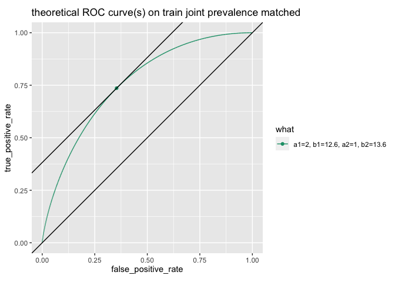
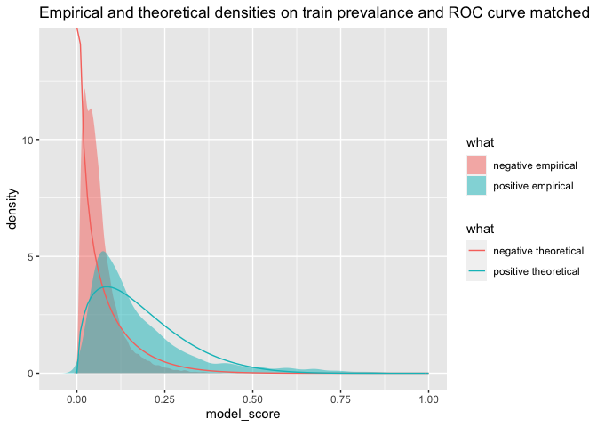
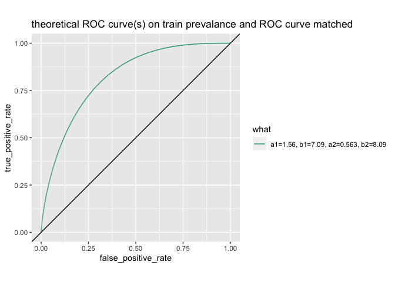
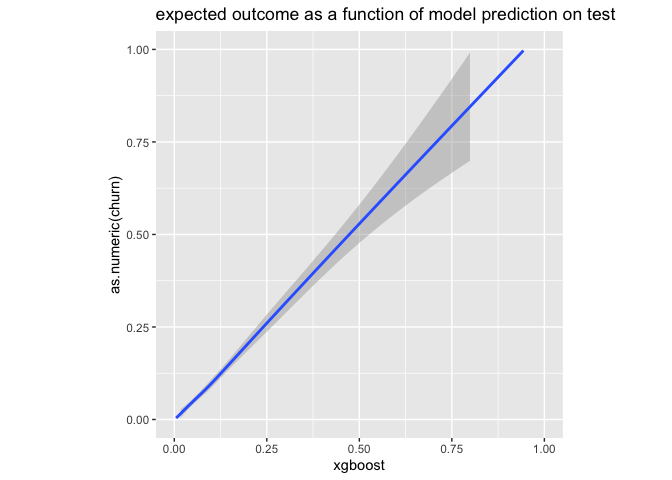
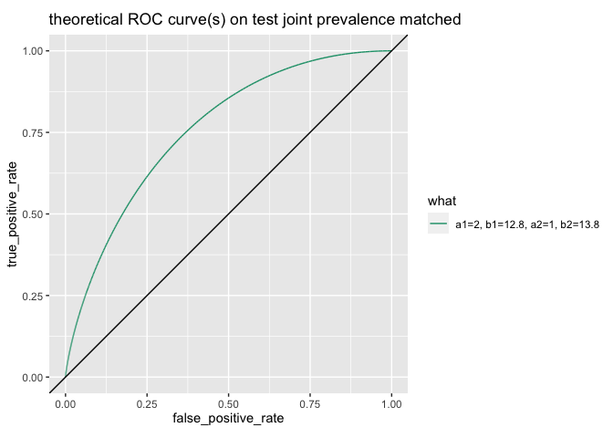
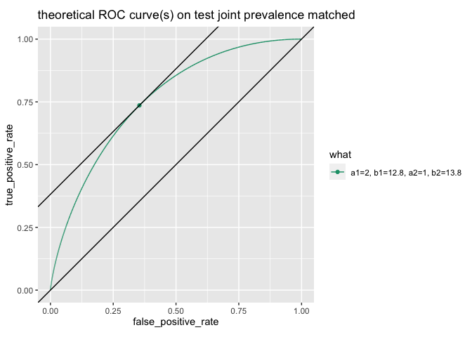

Prediction Plot
================

See if we can infer distributional facts from the empirical ROC plot.

It looks like the prevalence is not obvious from the empirical plot,
though it is where the parameterization achieves slope 1, which is also
where the distance off the diagonal is maximized.

``` r
library(wrapr)
library(ggplot2)
library(WVPlots)
```

``` r
unpack[
  train_p,
  test_p
] <- readRDS('predictions.RDS') 
# from https://github.com/WinVector/vtreat/tree/main/Examples/KDD2009
```

``` r
mk_frame_idea_ab <- function(a, b, eval_points = seq(0, 1, 1e-5)) {
  data.frame(
    what = paste0("a=", format(a, digits = 3), ', b=', format(b, digits = 3)),
    model_score = eval_points,
    false_positive_rate = 1 - pbeta(eval_points, shape1 = a, shape2 = b + 1),
    true_positive_rate = 1 - pbeta(eval_points, shape1 = a + 1, shape2 = b),
    stringsAsFactors = FALSE)
}


mk_frame_idea_a1b1a2b2 <- function(a1, b1, a2, b2, eval_points = seq(0, 1, 1e-5)) {
  data.frame(
    what = paste0("a1=", format(a1, digits = 3), 
                  ', b1=', format(b1, digits = 3),
                  "a2=", format(a2, digits = 3), 
                  ', b2=', format(b2, digits = 3)),
    model_score = eval_points,
    false_positive_rate = 1 - pbeta(eval_points, shape1 = a1, shape2 = b1),
    true_positive_rate = 1 - pbeta(eval_points, shape1 = a2, shape2 = b2),
    stringsAsFactors = FALSE)
}


mk_plot <- function(data, mn) {
  ggplot(
    data = data,
    mapping = aes(
      x = false_positive_rate, 
      y = true_positive_rate, 
      color = what)) +
    geom_line() + 
    geom_abline(intercept = 0, slope = 1) +
    coord_fixed() +
    scale_color_brewer(palette = "Dark2") +
    ggtitle(paste0(
      "theoretical ROC curve(s) on ", mn))
}
```

``` r
work_example <- function(mf, mn) {
  print(mn)
  print(paste0('prevalence: ', mean(mf$churn)))
  
  print(ggplot(
    data = mf,
    mapping = aes(x = xgboost, y = as.numeric(churn))) +
      coord_fixed() +
      xlim(c(0, 1)) + ylim(c(0, 1)) +
      geom_smooth() + 
      ggtitle(paste0("expected outcome as a function of model prediction on ", mn)))
  
  print(DoubleDensityPlot(
    mf,
    xvar = 'xgboost',
    truthVar = 'churn',
    title = paste0("double density on ", mn)))
  
  conditional_means <- aggregate(xgboost ~ churn, data = mf, FUN = mean)
  print(paste0("conditional means: ", conditional_means))
  
  a <- 1 / (conditional_means$xgboost[conditional_means$churn == TRUE] / 
              conditional_means$xgboost[conditional_means$churn == FALSE] - 1)
  b <- a / conditional_means$xgboost[conditional_means$churn == FALSE] - (a + 1)
  print(paste0("a= ", a, ", b= ", b, ", a/(a+b)= ", a/(a+b)))
  
  d_pos <- density(mf$xgboost[mf$churn])
  d_neg <- density(mf$xgboost[!mf$churn])
  
  evals <- seq(0, 1, by = 0.01)
  tf <- rbind(
    data.frame( 
      model_score = evals,
      density = dbeta(evals, shape1 = a + 1, shape2 = b),
      what = 'positive theoretical',
      stringsAsFactors = FALSE),
    data.frame( 
      model_score = evals,
      density = dbeta(evals, shape1 = a, shape2 = b + 1),
      what = 'negative theoretical',
      stringsAsFactors = FALSE),
    data.frame( 
      model_score = d_pos$x,
      density = d_pos$y,
      what = 'positive empirical',
      stringsAsFactors = FALSE),
    data.frame( 
      model_score = d_neg$x,
      density = d_neg$y,
      what = 'negative empirical',
      stringsAsFactors = FALSE))
  
  print(ggplot() +
          geom_ribbon(
            data = tf[!(tf$what %in% c('positive empirical', 'negative empirical')), ],
            mapping = aes(x = model_score, ymin = 0, ymax = density, fill = what), alpha = 0.5) +
          geom_line(
            data = tf[tf$what %in% c('positive empirical', 'negative empirical'), ],
            mapping = aes(x = model_score, y = density, color = what)) +
          ggtitle(paste0("Empirical and theoretical densities on ", mn)))
  
  print(ROCPlot(
    mf,
    xvar = 'xgboost',
    truthVar = 'churn',
    truthTarget = TRUE,
    title = paste0('model on ', mn),
    add_convex_hull = TRUE))
  
  pf <- mk_frame_idea_ab(a, b)
  print(ROCPlot(
    mf,
    xvar = 'xgboost',
    truthVar = 'churn',
    truthTarget = TRUE,
    title = paste0('model on ', mn, ', with mean-fit ROC curve')) + 
      geom_line(
        data = pf,
        mapping = aes(
          x = false_positive_rate, 
          y = true_positive_rate),
        linetype = 3,
        color = "DarkGreen"))
  
  # Use the method of "A Single Parameter Family Characterizing Probability Model Performance" to identify the ROC curve from the restricted family.
  # 
  # First get `a, b` shape family. We are considering curves of the form `(a = c * a1, b = c * b1)` for positive `c`.
  
  prevalence <- mean(mf$churn)
  print(paste0("prevalence: ", prevalence))
  
  a1 <- 1
  b1 <- a1 * (1 - prevalence) / prevalence
  print(paste0("a1= ", a1, ", b1= ", b1, ", a1/(a1+b1)= ", a1/(a1+b1)))
  
  # Now get the ideal AUC seen.
  calc_area <- function(x, y) {
    n <- nrow(data)
    dx <- abs(x[-length(x)] - x[-1])
    my <- (y[-length(x)] + y[-1])/2
    sum(dx*my)
  }
  
  roc_curve <- sigr::build_ROC_curve(
    modelPredictions = mf$xgboost, 
    yValues = mf$churn)
  
  idxs <- sort(unique(chull(
    x = c(1 - roc_curve$Specificity, 1),
    y = c(roc_curve$Sensitivity, 0))))
  idxs <- idxs[-length(idxs)]
  convex_hull <- roc_curve[idxs, ]
  target_area <- calc_area(
    x = 1 - convex_hull$Specificity, 
    y = convex_hull$Sensitivity)
  
  print(paste0('target_area: ', target_area))
  
  pf <- mk_frame_idea_ab(a1, b1)
  
  print(mk_plot(pf, mn))
  
  print(calc_area(
    x = pf$false_positive_rate,
    y = pf$true_positive_rate))
  
  f <- function(x) {
    a <- x[[1]]
    b <- a * (1 - prevalence) / prevalence
    of <- mk_frame_idea_ab(a = a, b = b)
    fn <- suppressWarnings(approxfun(
      x = of$false_positive_rate, 
      y = of$true_positive_rate))
    evals <- fn(1 - roc_curve$Specificity)
    sum((roc_curve$Sensitivity - evals)^2)
  }
  soln <- optimize(f, c(0, 100))
  print(soln)
  
  a <- soln$minimum
  b <- a * (1 - prevalence) / prevalence
  print(paste0("a= ", a, ", b= ", b, ", a/(a+b)= ", a/(a+b)))
  
  pf <- mk_frame_idea_ab(a, b)
  idx <- which.min(abs(prevalence - pf$model_score))
  print(pf[idx, ])
  
  print(mk_plot(pf, mn) + 
          geom_point(
            data = pf[idx, ],
            mapping = aes(
              x = false_positive_rate, 
              y = true_positive_rate)) +
          geom_abline(
            intercept = pf$true_positive_rate[[idx]] - pf$false_positive_rate[[idx]],
            slope = 1))
  
  
  print(calc_area(
    x = pf$false_positive_rate,
    y = pf$true_positive_rate))
  
  print(ROCPlot(
    mf,
    xvar = 'xgboost',
    truthVar = 'churn',
    truthTarget = TRUE,
    title = paste0('model on ', mn, ', compared to theoretical')) + 
      geom_line(
        data = pf,
        mapping = aes(
          x = false_positive_rate, 
          y = true_positive_rate),
        linetype = 3,
        color = "DarkGreen"))
  
  # Fit both parameters, by shape.
  
  f2 <- function(x) {
    a <- x[[1]]
    b <- x[[2]]
    of <- mk_frame_idea_ab(a = a, b = b)
    fn <- suppressWarnings(approxfun(
      x = of$false_positive_rate, 
      y = of$true_positive_rate))
    evals <- fn(1 - roc_curve$Specificity)
    sum((roc_curve$Sensitivity - evals)^2)
  }
  
  print(f2(c(a, b)))
  
  soln2 <- optim(
    par = c(a, b),
    fn = f2,
    method = 'L-BFGS-B',
    lower = c(0, 0))
  print(soln2)
  
  a2 <- soln2$par[[1]]
  b2 <- soln2$par[[2]]
  print(paste0("a2= ", a2, ", b2= ", b2, ", a2/(a2+b2)= ", a2/(a2+b2)))
  
  pf2 <- mk_frame_idea_ab(a2, b2)
  idx2 <- which.min(abs(a2/(a2 + b2) - pf2$model_score))
  print(pf2[idx2, ])
  
  print(mk_plot(pf2, mn) + 
          geom_point(
            data = pf2[idx2, ],
            mapping = aes(
              x = false_positive_rate, 
              y = true_positive_rate)) +
          geom_abline(
            intercept = pf2$true_positive_rate[[idx]] - pf2$false_positive_rate[[idx]],
            slope = 1))
  
  
  print(calc_area(
    x = pf2$false_positive_rate,
    y = pf2$true_positive_rate))
  
  print(ROCPlot(
    mf,
    xvar = 'xgboost',
    truthVar = 'churn',
    truthTarget = TRUE,
    title = paste0('model on ', mn, ', compared to theoretical2')) + 
      geom_line(
        data = pf2,
        mapping = aes(
          x = false_positive_rate, 
          y = true_positive_rate),
        linetype = 3,
        color = "DarkGreen"))
  
  invisible(NULL)
}
```

Train
-----

``` r
work_example(train_p, 'train')
```

    ## [1] "train"
    ## [1] "prevalence: 0.0735555555555556"

    ## `geom_smooth()` using method = 'gam' and formula 'y ~ s(x, bs = "cs")'

    ## Warning: Removed 19 rows containing missing values (geom_smooth).

<!-- --><!-- -->

    ## [1] "conditional means: c(FALSE, TRUE)"                          
    ## [2] "conditional means: c(0.0658697948849392, 0.178439974513895)"
    ## [1] "a= 0.585144263801065, b= 7.29820302494016, a/(a+b)= 0.0742253566117469"

<!-- --><!-- --><!-- -->

    ## [1] "prevalence: 0.0735555555555556"
    ## [1] "a1= 1, b1= 12.595166163142, a1/(a1+b1)= 0.0735555555555556"
    ## [1] "target_area: 0.813642950884061"

<!-- -->

    ## [1] 0.7595455
    ## $minimum
    ## [1] 0.5625448
    ## 
    ## $objective
    ## [1] 37.91684
    ## 
    ## [1] "a= 0.562544814509275, b= 7.08534541295821, a/(a+b)= 0.0735555555555556"
    ##                 what model_score false_positive_rate true_positive_rate
    ## 7357 a=0.563, b=7.09     0.07356           0.3093546          0.7902399

<!-- -->

    ## [1] 0.818262

<!-- -->

    ## [1] 37.91684
    ## $par
    ## [1] 1.342247 1.120087
    ## 
    ## $value
    ## [1] 0.9419788
    ## 
    ## $counts
    ## function gradient 
    ##       31       31 
    ## 
    ## $convergence
    ## [1] 0
    ## 
    ## $message
    ## [1] "CONVERGENCE: REL_REDUCTION_OF_F <= FACTR*EPSMCH"
    ## 
    ## [1] "a2= 1.34224660685369, b2= 1.12008690658619, a2/(a2+b2)= 0.545111618522615"
    ##                 what model_score false_positive_rate true_positive_rate
    ## 54512 a=1.34, b=1.12     0.54511           0.2639962          0.7259015

<!-- -->

    ## [1] 0.8109464

<!-- -->

Test
----

``` r
work_example(test_p, 'test')
```

    ## [1] "test"
    ## [1] "prevalence: 0.0724"

    ## `geom_smooth()` using method = 'gam' and formula 'y ~ s(x, bs = "cs")'

    ## Warning: Removed 1 rows containing missing values (geom_smooth).

<!-- --><!-- -->

    ## [1] "conditional means: c(FALSE, TRUE)"                          
    ## [2] "conditional means: c(0.0673460909607208, 0.148062062141028)"
    ## [1] "a= 0.834358925203045, b= 10.5547628976163, a/(a+b)= 0.0732592853235895"

<!-- --><!-- --><!-- -->

    ## [1] "prevalence: 0.0724"
    ## [1] "a1= 1, b1= 12.8121546961326, a1/(a1+b1)= 0.0724"
    ## [1] "target_area: 0.750178682466962"

<!-- -->

    ## [1] 0.7593899
    ## $minimum
    ## [1] 1.159244
    ## 
    ## $objective
    ## [1] 4.403791
    ## 
    ## [1] "a= 1.15924365035961, b= 14.8524089789167, a/(a+b)= 0.0724"
    ##                what model_score false_positive_rate true_positive_rate
    ## 7241 a=1.16, b=14.9      0.0724           0.3641095          0.7225412

<!-- -->

    ## [1] 0.7447718

<!-- -->

    ## [1] 4.403791
    ## $par
    ## [1] 4.224174 1.591359
    ## 
    ## $value
    ## [1] 0.9509045
    ## 
    ## $counts
    ## function gradient 
    ##       45       45 
    ## 
    ## $convergence
    ## [1] 0
    ## 
    ## $message
    ## [1] "CONVERGENCE: REL_REDUCTION_OF_F <= FACTR*EPSMCH"
    ## 
    ## [1] "a2= 4.22417422194232, b2= 1.59135880319764, a2/(a2+b2)= 0.726360628283193"
    ##                 what model_score false_positive_rate true_positive_rate
    ## 72637 a=4.22, b=1.59     0.72636           0.3024059          0.6528713

<!-- -->

    ## [1] 0.7408969

<!-- -->
