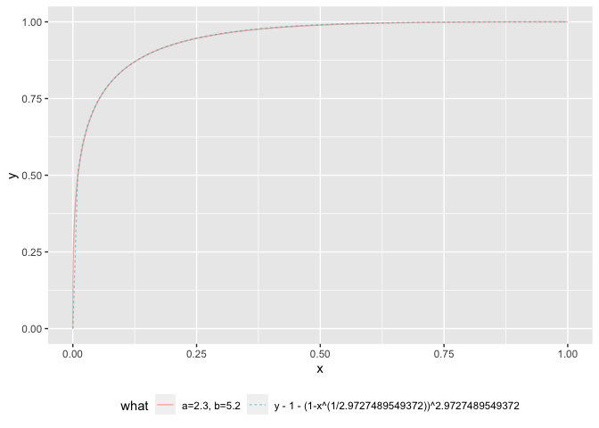

ROC\_beta
================

This quick note is an aside related to [The Typical Shape of the ROC
plot](https://github.com/WinVector/Examples/blob/main/rebalance/ROC_shape.md).

``` r
library(ggplot2)
```

    ## Warning: replacing previous import 'vctrs::data_frame' by 'tibble::data_frame'
    ## when loading 'dplyr'

``` r
mk_curve_beta <- function(a, b, left = 0, right = 1) {
  d <- data.frame(
    t = seq(left, right, length.out = 101)
  )
  d$x <- 1 - pbeta(d$t, shape1 = a, shape2 = b)
  d$y <- 1 - pbeta(d$t, shape1 = b, shape2 = a)
  d$a <- a
  d$b <- b
  d$what <- paste0('a=', a, ', b=', b)
  d
}

mk_curve_polynomial <- function(b, left = 0, right = 1) {
  d <- data.frame(
    t = NA,
    x = seq(left, right, length.out = 101)
  )
  d$y <- 1 - (1 - d$x^(1/b))^b
  d$a <- 1
  d$b <- b
  d$what <- paste0('y - 1 - (1-x^(1/', b,'))^', b)
  d
}

plot_curve_list <- function(curves) {
  ggplot(data = curves,
         aes(x = x, y = y, color = what, linetype=what)) + 
    geom_line(alpha = 0.5) +
    theme(legend.position="bottom")
}

c1 <- mk_curve_beta(1, 3.4)
c2 <- mk_curve_polynomial(3.4)
plot_curve_list(do.call(rbind, list(c1, c2)))
```

<!-- -->

``` r
c1 <- mk_curve_beta(2.3, 3.4)
target_x <- c1$x[c1$t==0.5][[1]]
# solve for (1-0.5)^b == target_x
b_soln <- log(target_x) / log(0.5)
c2 <- mk_curve_polynomial(b_soln)
plot_curve_list(do.call(rbind, list(c1, c2)))
```

<!-- -->

``` r
c1 <- mk_curve_beta(2.3, 5.2)
target_x <- c1$x[c1$t==0.5][[1]]
# solve for (1-0.5)^b == target_x
b_soln <- log(target_x) / log(0.5)
c2 <- mk_curve_polynomial(b_soln)
plot_curve_list(do.call(rbind, list(c1, c2)))
```

<!-- -->

There may be plotting artifacts as the two curves are parameterized at
much different rates. So at some places we are comparing one curve to
the linear interpolation of the other.
