The Typical Shape of the ROC plot
================

## Introduction

The [`ROC plot` (receiver operating characteristic
plot)](https://en.wikipedia.org/wiki/Receiver_operating_characteristic)
we exhibited in the note [“0.83 is a Special
AUC”](https://win-vector.com/2020/09/06/0-83-is-a-special-auc/) look
*very* familiar to experienced data scientists.

[](https://win-vector.com/2020/09/06/0-83-is-a-special-auc/)

This left-bow shape is *very* common in data science projects. In fact,
we will show that it is an archetypal shape one should look for in
projects.

In this note we will show this is not the only shape, but that the above
shape is archetypal. This means the other shapes may be anthologies
indicating more work is needed in a project.

## Non-Standard Shapes

Let’s work some example ROC shapes in [`R`](https://www.r-project.org).

In each case we will produce an artificial data frame that could be
predictions of a model aligned with actual outcomes. For each of these
we will plot the ROC plot. Because of this procedure each of these ROC
shapes *could* in fact occur in a data science project.

First we attach our packages and define our first example function.

``` r
library(ggplot2)
```

    ## Warning: replacing previous import 'vctrs::data_frame' by 'tibble::data_frame'
    ## when loading 'dplyr'

``` r
library(wrapr)
library(WVPlots)
```

This is a simulated classifier that returns only two scores: 0.25 and
0.75. The simulated classifier is useful, it returns the large score
more often for the true class.

``` r
extreme_example <- function(n, sensitivity, specificity) {
  d <- data.frame(
    y = sample(
      c(TRUE, FALSE), 
      size = n, 
      replace = TRUE),
    score = 0.0
  )
  d$score[d$y] <- sample(
    c(0.25, 0.75), 
    size = sum(d$y), 
    replace = TRUE,
    prob = c(1 - sensitivity, sensitivity))
  d$score[!d$y] <- sample(
    c(0.25, 0.75), 
    size = sum(!d$y), 
    replace = TRUE,
    prob = c(specificity, 1 - specificity))
  d
}
```

The detailed distribution of scores can be seen in a double density
plot.

``` r
example_1 <- extreme_example(1000, 0.75, 0.75)

DoubleDensityPlot(
  example_1,
  xvar = 'score', 
  truthVar = 'y',
  title = 'Symmetric 2 score Example conditional density')
```

<!-- -->

The scores are multi-modal, which is often a concern, but the high
scores are more associated with `y = TRUE`.

The ROC plot of this simulated model result looks like the following

``` r
ROCPlot(
  extreme_example(1000, 0.75, 0.75), 
  xvar = 'score', 
  truthVar = 'y', truthTarget = TRUE, 
  title = 'Symmetric 2 score Example ROC')
```

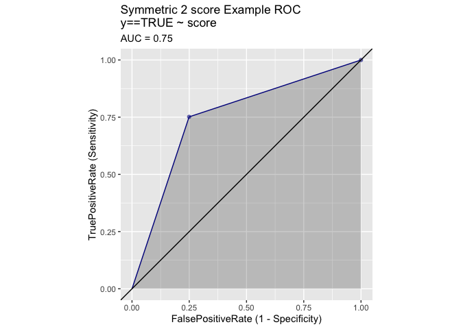<!-- -->

The 2-segment or very polygonal ROC plot is something to look out for.
In Python sklearn it may mean you made the mistake of calling
`.predict()` when you meant to call `.predict_proba()`.

Notice the following to `ROC` plots are not nested- each is better than
the other in complementary regions.

These simulated 2-score modeling results also give us convenient
examples of ROC plots that have radically different behavior.

``` r
ROCPlot(
  extreme_example(1000, 0.5, 1),
  xvar = 'score', 
  truthVar = 'y', truthTarget = TRUE, 
  title = 'example with:\n  good sensitivity at high specificity and\n  poor specificity at high sensitivity')
```

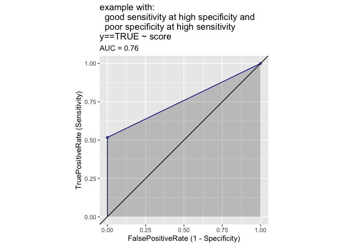<!-- -->

``` r
ROCPlot(
  extreme_example(1000, 1, 0.5), 
  xvar = 'score', 
  truthVar = 'y', truthTarget = TRUE, 
  title = 'example with:\n  poor sensitivity at high specficity and\n  good specificity at high sensitivity ')
```

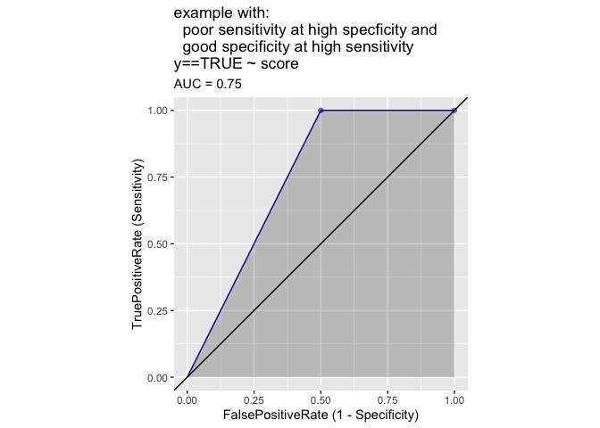<!-- -->

This shows that ROC plots are not always symmetric along diagonal line
between (0, 1) and (1, 0), and for any pair of ROC plots it is not the
case one is always contained in the other.

Another odd shape is given by a simulated modeling result where the
scores are distributed uniformly when conditioned on the outcome.

``` r
interval_example <- rbind(
  data.frame(score = seq(0, 2/3, length.out = 100),
             y = FALSE),
  data.frame(score = seq(1/3, 1, length.out = 100),
             y = TRUE))

DoubleDensityPlot(
  interval_example, 
  xvar = 'score', 
  truthVar = 'y',
  title = 'interval example')
```

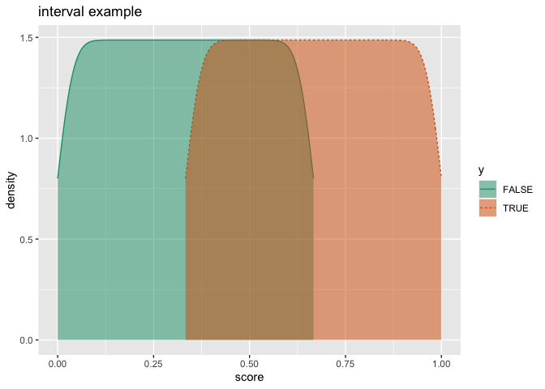<!-- -->

``` r
ROCPlot(
  interval_example, 
  xvar = 'score', 
  truthVar = 'y', truthTarget = TRUE, 
  title = 'interval example')
```

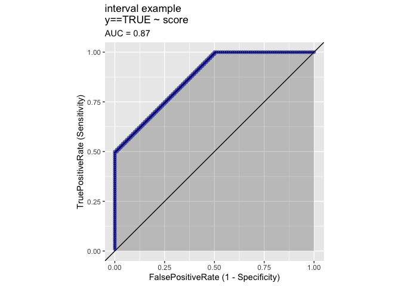<!-- -->

We now move to some more natural examples. In this case we are
simulating the results of classification score that is
[beta-distributed](https://en.wikipedia.org/wiki/Beta_distribution) when
conditioned on the depending variable or outcome. This is a very
plausible and common situation.

``` r
beta_example <- function(
  n, 
  shape1_pos, shape2_pos, 
  shape1_neg, shape2_neg) {
  d <- data.frame(
    y = sample(
      c(TRUE, FALSE), 
      size = n, 
      replace = TRUE),
    score = 0.0
  )
  d$score[d$y] <- rbeta(sum(d$y), shape1 = shape1_pos, shape2 = shape2_pos)
  d$score[!d$y] <- rbeta(sum(!d$y), shape1 = shape1_neg, shape2 = shape2_neg)
  d
}
```

Here is a simple such example.

``` r
d <- beta_example(
  10000,
  shape1_pos = 2, 
  shape2_pos = 1,
  shape1_neg = 1, 
  shape2_neg = 2)
```

First as a conditional density plot.

``` r
DoubleDensityPlot(
  d,
  xvar = 'score',
  truthVar = 'y',
  truth_target = TRUE,
  title = "Symmetric example where scores are beta-distributed")
```

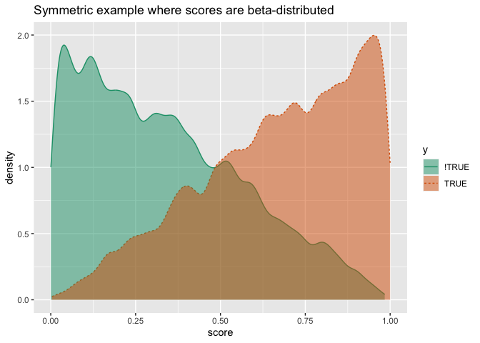<!-- -->

And now as an ROC plot.

``` r
ROCPlot(
  d, 
  xvar = 'score', 
  truthVar = 'y', truthTarget = TRUE, 
  title = "Symmetric example where scores are beta-distributed")
```

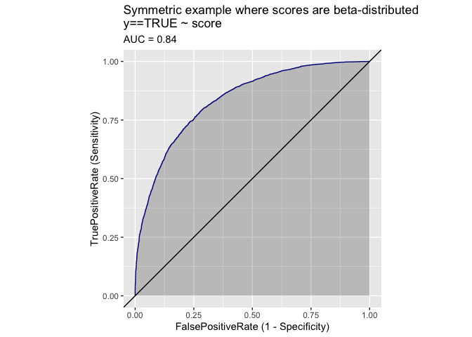<!-- -->

The above shape is in fact *very* common. As we said, we saw it in [our
uniform score distribution
example](https://win-vector.com/2020/09/06/0-83-is-a-special-auc/) and
it commonly occurs in real world examples (for instance
[here](https://github.com/WinVector/PDSwR2/blob/main/KDD2009/KDD2009vtreat.md);
both in the training and test graphs). We will later argue there are
reasons this shape is the normal or archetypal shape of an ROC plot.

However, the above shape family is not the only possibility. Even these
nice “scores are conditionally beta-distributed” case we can have
asymmetric and even non-convex examples.

One way things can go wrong is: one of the conditional distributions
could be very diffuse, meaning predictions are high variance or
unreliable for that outcome class. We give such an example below.

``` r
d1 <- beta_example(
  10000,
  shape1_pos = 6, 
  shape2_pos = 6,
  shape1_neg = 1, 
  shape2_neg = 2)

DoubleDensityPlot(
  d1,
  xvar = 'score',
  truthVar = 'y',
  truth_target = TRUE,
  title = "Example where scores are beta-distributed (d1)")
```

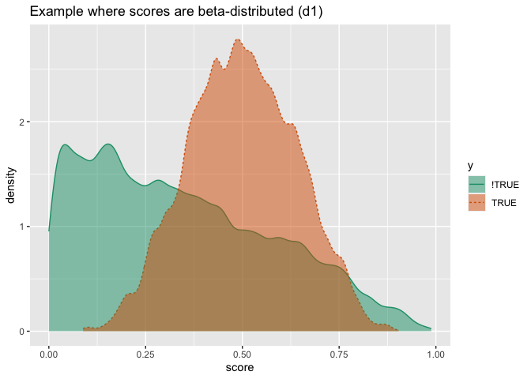<!-- -->

Here is a similar example with which class is diffuse reversed.

``` r
d2 <- beta_example(
  10000,
  shape1_pos = 2, 
  shape2_pos = 1,
  shape1_neg = 6, 
  shape2_neg = 6)

DoubleDensityPlot(
  d2,
  xvar = 'score',
  truthVar = 'y',
  truth_target = TRUE,
  title = "Example where scores are beta-distributed (d2)")
```

<!-- -->

When we plot both of these ROC plots on the same graph we see they are
asymmetric, neither is dominant or better, and they also are not convex.

``` r
ROCPlotPair2(
  nm1 = 'd1',
  frame1 = d1,
  xvar1 = 'score',
  truthVar1 = 'y',
  truthTarget1 = TRUE,
  nm2 = 'd2',
  frame2 = d2,
  xvar2 = 'score',
  truthVar2 = 'y',
  truthTarget2 = TRUE,
  title = 'comparison',
  estimate_sig = FALSE)
```

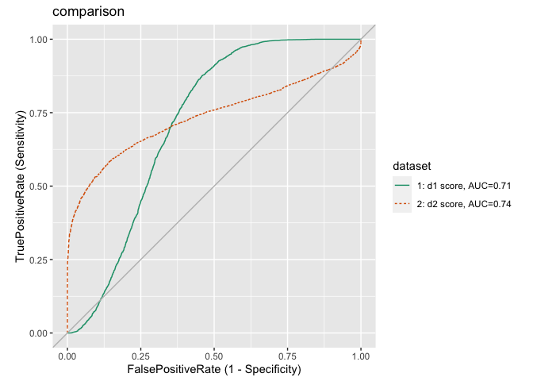<!-- -->

The point to remember is: there is a diversity of possible `ROC` plot
shapes, even in fairly restrictive circumstances. In the next section we
move away from odd ROC shapes to the archetypal one we expect in data
science projects.

## The Expected AUC shape

If we limit ourselves to the special case where each of the model-scores
is beta-distributed conditioned on the outcome, with the *additional*
constraint that the parameters are reversed then we get a very
interesting family of curves we call the archetypal ROC shapes. By
“parameters reversed” we mean if the negative-example scores are
distributed with beta-distribution shape parameters (a,b), then the
positive-example scores are distributed with beta-distribution
parameters (b,a). That is: the densities are mirrored. For convenience
will limit ourselves to a \> b \>= 1.

In this case we have the following strong claim.

<pre>
The ROC plot curve is: 

   y = 1 - (1 - x^(1/s))^s
   
where s is:

  s = log(1 - I(1/2; b, a)) / log(0.5)
  
where I(t; a, b) is the incomplete beta function.
</pre>

Let’s try that. First we try an arbitrary curve meeting our mirror
conditions.

``` r
d_example <- beta_example(
  10000,
  shape1_pos = 5.2, 
  shape2_pos = 2.3,
  shape1_neg = 2.3, 
  shape2_neg = 5.2)

DoubleDensityPlot(
  d_example,
  xvar = 'score',
  truthVar = 'y',
  truth_target = TRUE,
  title = "Example where scores are mirror beta-distributed")
```

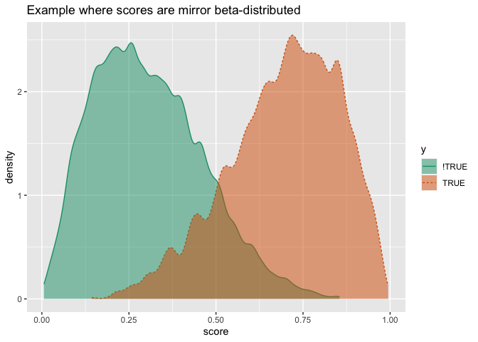<!-- -->

``` r
ROCPlot(
  d_example,
  xvar = 'score',
  truthVar = 'y',
  truthTarget = TRUE,
  title = "Example where scores are mirror beta-distributed")
```

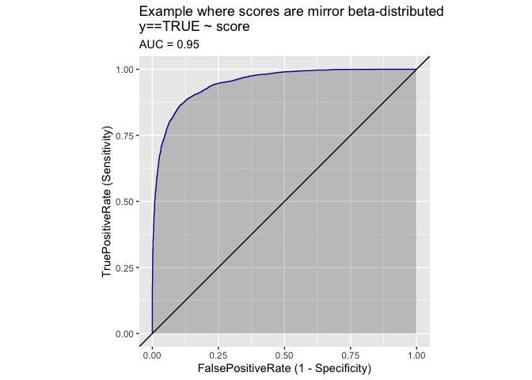<!-- -->

We solve for s.

``` r
s = log(1 - pbeta(0.5, 2.3, 5.2)) / log(0.5)
s
```

    ## [1] 2.972749

And then plot the curve.

``` r
mk_curve_polynomial <- function(s, left = 0, right = 1) {
  d <- data.frame(
    x = seq(left, right, length.out = 101)
  )
  d$y <- 1 - (1 - d$x^(1/s))^s
  d$what <- paste0('y = 1 - (1-x^(1/', s,'))^', s)
  d
}

poly_curve <- mk_curve_polynomial(s)
ggplot(
  data = poly_curve,
  mapping = aes(x = x, y = y)) +
  geom_line() + 
  theme(aspect.ratio=1) + 
  ggtitle(poly_curve$what[[1]])
```

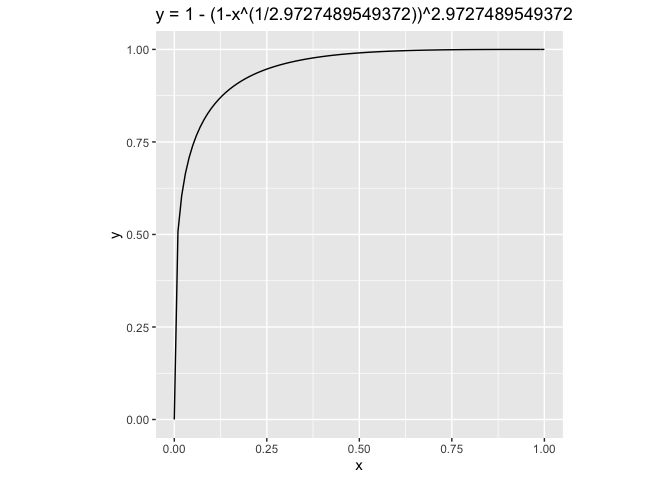<!-- -->

We can empirically confirm this is the same curve as follows.

``` r
roc_curve <- WVPlots:::graphROC(
  modelPredictions = d_example$score, 
  yValues = d_example$y)
```

``` r
ggplot() +
  geom_point(
    data = roc_curve$pointGraph,
    mapping = aes(x = FalsePositiveRate, y = TruePositiveRate),
    color = "DarkOrange",
    alpha = 0.2) +
  geom_line(
    data = poly_curve,
    mapping = aes(x = x, y = y),
    color = "DarkBlue") +
  theme(aspect.ratio=1) +
  ggtitle("Orange points from ROC plot, line from matching polynomial shape")
```

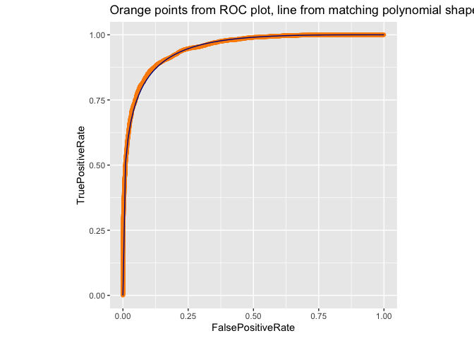<!-- -->

Notice how the line stacks on the curve (we believe the slight variation
are plotting/interpolation artifacts).

We won’t completely prove the above claims here.

In general the AUC curves for these mirrored forms are given
parametrically as:

<pre>
x(t) = 1 - I(t; b, a)
y(t) = 1 - I(t; a, b)
     = 1 - x(1 - t)
</pre>

This is already enough to show mirror symmetry around the line between
(0,1) and (1,0) as that reflection carries (x,y) to (1-y, 1-x).

For a=1 then the AUC curve is then:

<pre>
x(t) = (1 - t)^b
y(t) = 1 - t^b
</pre>

We eliminate the classifier threshold t, to get a non-parameterized
version of this curve:

<pre>
(1 - y)^(1/b) + x^(1/b) = 1 
</pre>

This *is* the curve for the a=1 case. The claimed s is just given by
solving for a curve with shape parameters (a,b) for what value is of s
to we have the following two expression equal as shown below.

<pre>
(1 - 0.5)^s  == 1 - I(t; a, b)
</pre>

The expressions are just saying where each curve places its x-value on
the line joining (0,1) to (1,0). Solving we get s = log(1 - I(1/2; b,
a)) / log(0.5).

So we have proven everything in the a=1 special case. All that remains
would be to show this generalizes for arbitrary a\>=1 (which we will not
do here).

## Conclusion

It is our claim, that while ROC plots can be diverse (and we have given
examples here) that the ROC plots produced from mirror-symmetric
conditional beta distributions are (ideally) all graphs of the form:

<pre>
(1 - y)^(1/s) + x^(1/s) = 1 
</pre>

for s\>=1.

This single parameter family of curves are all symmetric, convex, and
comparable (for any pair one is contained in the other)- which are
*very* nice properties not generally true of the ROC plot. It is our
further, unproven, claim that you expect this shape in sufficiently rich
(enough variables, powerful enough models, and enough examples) modeling
situations. As the mirrored conditional beta family is nominally
parameterized by two parameters, the fact that the non-parameterized
version of these plots is indexed by a single parameter means we are
exploiting a underlying symmetry or identity in these plot families.

The ROC plot family looks like the following.

``` r
plots <- lapply(
  seq(1, 6, length.out = 12),
  mk_curve_polynomial
)
plots <- do.call(rbind, plots)

ggplot(
  data = plots,
  mapping = aes(x = x, y = y, color = what)) +
  geom_line() +
  theme(aspect.ratio=1,
        legend.position = 'none') + 
  ggtitle("many archtypical ROC plots")
```

<!-- -->

And there we have it: why so many ROC plots look so similar.
