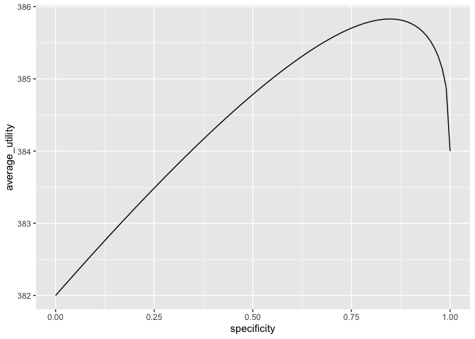

Utility\_Calc
================

Here we show how to use the ideal ROC curve demonstrated
[here](https://github.com/WinVector/Examples/blob/main/rebalance/ROC_shape.md)
to pick an optimal utility threshold.

We can use this parametric idealization to simplify choosing thresholds.

Suppose we are told our problem is predicting account cancellation. Our
model predicts the risk of cancellation with the above ROC curve.
“Positive” accounts are those that are going to cancel, though perhaps
we can alter that with an intervention.

And we are told (just using nominal figures here):

<ul>

<li>

Our customer population is n = 100,000

</li>

<li>

Time discounted customer lifetime value v = $400

</li>

<li>

The cancellation prevalence is p = 0.04

</li>

<li>

The cost of an intervention (calling the customer, offering a discount)
is s = $100, and moves the retention probability to f = 0.5

</li>

</ul>

Then we want to pick an intervention threshold that maximizes our
utility under the above model and specifications. The idea is: there is
an optimal sensitivity and specificity trade-off determined by the above
parameters. Obviously we want sensitivity = 1 and specificity = 1, but
we have to accept the base trade-off that our model’s supplies. What
sensitivity/specificity trade-offs are available for our model is
exactly the content of the ROC curve.

We define utility as:

<ul>

<li>

Each true negative is worth v, we see the customer lifetime value and
incur no intervention cost.

</li>

<li>

Each false positive is worth v-s, we see the customer lifetime value but
do incur the intervention cost.

</li>

<li>

Each false negative is worth 0, we lose the customer.

</li>

<li>

Each true positive is worth f\*v-s, we incur the intervention cost and
maybe retain the customer.

</li>

</ul>

So the expected value per-customer of a decision rule is:

<pre>
true_negative_count * v + 
   false_positive_count * (v-s) + 
   false_negative_count * 0 + 
   true_positive_count * (f*v - s)
</pre>

So our utility function is defined as thus, using the `q = 0.61` example
from [here]().

``` r
q = 0.61

n = 100000
v = 400
p = 0.04
s = 10
f = 0.5

fn <- function(specificity) {
  # our model
  sensitivity = 1 - (1 -  (1-specificity)^q^(1/q))
  
  # standard definitions
  false_positive_rate = 1 - specificity
  false_negative_rate = 1 - sensitivity
  true_positive_rate = sensitivity
  true_negative_rate = specificity
  
  # to counts
  positive_count = n * p
  negative_count = n - positive_count
  false_positive_count = false_positive_rate * negative_count
  true_positive_count = true_positive_rate * positive_count
  true_negative_count = true_negative_rate * negative_count
  false_negative_count = false_negative_rate * positive_count
  
  # total utility
  utility = true_negative_count * v + 
   false_positive_count * (v-s) + 
   false_negative_count * 0 + 
   true_positive_count * (f*v - s)
  
  # re-normalize
  average_utility = utility / n
  data.frame(
    specificity = specificity,
    sensitivity = sensitivity,
    false_positive_rate = false_positive_rate,
    false_negative_rate = false_negative_rate,
    true_positive_rate = true_positive_rate,
    true_negative_rate = true_negative_rate,
    false_positive_count = false_positive_count,
    true_positive_count = true_positive_count,
    true_negative_count = true_negative_count,
    false_negative_count = false_negative_count,
    average_utility = average_utility
  )
}
```

We can plot and optimize this easily.

``` r
library(ggplot2)
```

    ## Warning: replacing previous import 'vctrs::data_frame' by 'tibble::data_frame'
    ## when loading 'dplyr'

``` r
d_utility <- fn(seq(0, 1, length.out = 101))

ggplot(
  data = d_utility,
  mapping = aes(x = specificity, y = average_utility)) +
  geom_line()
```

<!-- -->

The optimal trade-off is given here:

``` r
best_idx = which.max(d_utility$average_utility)[[1]]
str(d_utility[best_idx, ])
```

    ## 'data.frame':    1 obs. of  11 variables:
    ##  $ specificity         : num 0.85
    ##  $ sensitivity         : num 0.43
    ##  $ false_positive_rate : num 0.15
    ##  $ false_negative_rate : num 0.57
    ##  $ true_positive_rate  : num 0.43
    ##  $ true_negative_rate  : num 0.85
    ##  $ false_positive_count: num 14400
    ##  $ true_positive_count : num 1721
    ##  $ true_negative_count : num 81600
    ##  $ false_negative_count: num 2279
    ##  $ average_utility     : num 386

The model says, for this population, and these costs, our best trade-off
is to run at specificity 0.85 and sensitivity 0.43. This means we call
just under half of the at-risk customers while wasting interventions on
only 15 percent of the not at-risk customers. Due to the rareness of
cancellation this means our precision is in fact only 1721/(1721 +
2279), or only 43 percent (again the sensitivity). So half the
interventions are wasted, as the model can’t tell us which half is
wasted\! The optimal solution is trading-off cost of interaction with
possible loss of revenue. With different rates, revenue, and costs we
would have a different optimum trade-off.
